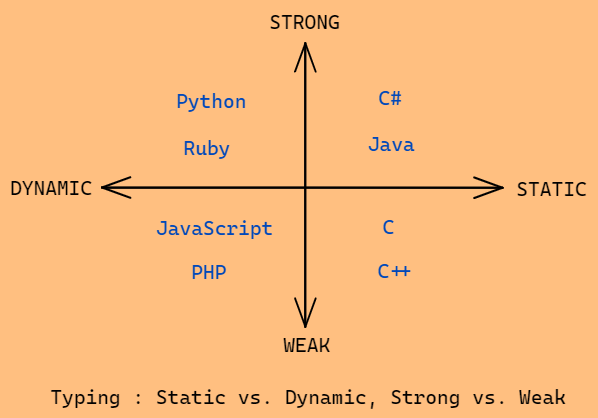
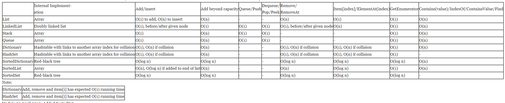
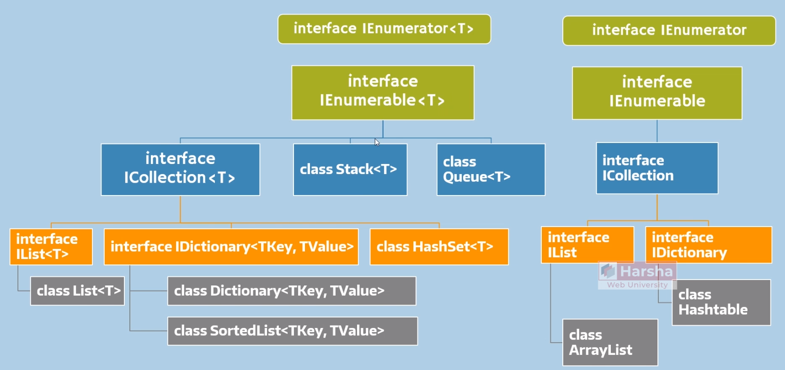

# What is .NET
* It's an application development platform to build desktop, web and mobile apps.
* It's not a language, but a technology to create apps that support multiple languages as C#, VB, etc
* Doesn't run directly on the OS but on the CLR - Common Language Runtime.

## Benefits of .NET
* Offers secure execution environment CLR
* Wide variety of applications and languages 
* Code reusability

## CLI - Common Language Infrastructure
C# => (Compiler) IL => (Execution Engine) CLR => Native Machine Code

## CLR - Common Language Runtime
Converts the IL language into machine code but also provides several other services as:

* Class loader
        Loads a class only when its needed (before creating the object)
* Memory Manager
        Allocates necessary memory for objects
        Local vars stored on the stack
        Objects stored in the heap
* Garbage Collection
        Frees memory by deleting objects that don't have active references (pointers)
* Exception Manager
        Catch exceptions and raises notifications while run-time errors.
        Creates exception logs
* Thread Manager
        Creates threads
        Manages the background threads created by the dev 
* JIT compiler
        Converts the IL Code into Native Machine Code
        Compiles the code of a class only when is needed (before executing the particular class)
* Security manager
        Manages permissions to access system resources.

## .NET Architecture
From smaller subset to superset:

BCL = Base class Library - I/O Operations, System Classes, Types, Console, etc

FCL = BCL + ADO.NET + ASP.NET + WPF...

.NET Framework  = CLR + FCL (Framework Class Library - Object Oriented collection of classes) 

.NET = .NET Framework + .NET Core

# Classification of language types

## Statically-typed vs Dynamically-typed
When type information is acquired (Either at compile time or at runtime)
Which means in the case of statically-type languages that all variables must first be declared before they can be used. This involves stating the variable's type and name.

## Strongly-typed vs Weakly-typed?
How strictly types are distinguished (e.g. whether the language tries to do an implicit conversion from strings to numbers).

# Heap and Stack
A stack is a special area of computer’s memory which stores temporary vars created by a function. In stack, vars are declared, stored and initialized during runtime.
It's a temporary storage memory. When the computing task is complete, the memory of the var will be automatically erased. The stack section mostly contains methods, local vars, and ref vars.

The heap is a memory used by programming languages to store global vars. By default, all global vars are stored in heap memory space. It supports Dynamic memory allocation.
The heap is not managed automatically for you and is not as tightly managed by the CPU. It is more like a free-floating region of memory.

# Coding Standards
* Reasonable variable names
* Proper Method Names
* Comment code

  1. single line "//"
  2. multiline /_comment_/
  3. xml documentation comment and regions
     "
     ///

     //This method does this thing
     ///

     "

     #region Public Properties
        ...//prop1
        ...//prop2
     #endregion
        //This allows you to create a region that you can minimize

  4. Class names with Capital Letters with PascalCasing (ex ClientActivity)
  5. Method names with the same approach (ex MainMethod)
  6. args passed inside the method with camelCase like firstName
  7. local variables with the same approach
  8. avoid abbreviations
  9. don't use "\_" between var names
  10. use singular nouns to name classes "Program", "Employee", "Invoice" etc
  11. to more coding conventions visit [C# Coding Standards Best Practices](https://www.dofactory.com/csharp-coding-standards)

# OOP Terminology and Concepts
* Object - small unit (entity) in the program. Can be a var, a data structure, a function, etc. It's an instance of a particular class.

* Class - Describes what functions and fields each instance of its kind will have. It's a model or a blueprint.

* Method - Collection of statements to perform a certain operation. They are members of a class.

* Namespace -Collection of classes that are logically related.

## Abstraction
Focuses on simplifying complex entities into essential characteristics.
Hides unnecessary details and provides a simplified view of objects or systems.
Helps manage complexity and improve understanding.
Provides clear interfaces for working with objects.

## Encapsulation
Involves bundling data and methods into a single unit (class).
Implements data hiding, restricting direct access to internal state.
Maintains data integrity and prevents unauthorized access.
Defines well-defined interfaces to interact with the encapsulated data.
In practice, abstraction and encapsulation often go hand in hand, as abstraction is commonly achieved through encapsulation. By encapsulating the data and methods within a class, you can abstract away the complexities of the internal implementation and provide a clean interface for working with objects.

## Inheritance
To define a class in terms of another class
Example:

        Base Class Car
                Derived Class Race Car
                Derived Class Streets Car

        Employee
                Designer
                Engineer

## Polymorphism
The fact that an object can have various forms and can be cast as its class or its base classes. Ex. A BMW which is created from the base class will show attributes and methods of that class, as opposed of a BMW created from the class BMW.

        Class BMW : Car

                Car bmw1 = New BMW();
                
                        is different from

                BMW bmw2 = New BMW();

## Has a relationship
When inside a class invokes another class as one of its members:

        Class Car 
        {
                public int HP {get; set;}
                public string Color {get; set;}

                //has a relationship
                protected CarIdInfo carIdInfo = new CarIdInfo();

                public void SetCarIdInfo(int idNum, string owner)
                {
                        carIdInfo.IDnum = idNum;
                        carIdInfo.Owner = owner;
                }
        }
        Class CarIdInfo
        {
                public int IDNum {get;set} = 0;
                public string Owner {get;set} = "No owner";
        }

# C# Language
* OOP language
* Case Sensitive
* Strongly-typed language
* Compiled

## Program and Main
The first class in a c# program is Program and it's entry point is the method Main, like so:

        class Program
        {
                static void Main(string[] args)
                {
                        ...
                }
        }

## Main args
On the debug properties, go to the application arguments, write your argument. 
Now from the main you can call arg[0]; 
From outside (command prompt), you can pass in arguments by executing the exe and space " " and then the arg. Ex

        C:\\Users\Admin\MainArgsDemo\bin\Debug\net5.0\MainArgsDemo.exe Denis

In case of top level statements, we can also use by default the args variable.

## Primitive (value) data types
Strictly store single values.
They're building blocks for non-primitive types.
Can be stored on the stack and the heap.
They're stored on the stack when they're params to the method or vars declared inside the method itself.
They're stored on the heap when they're members of a class (instance vars).

        sbyte x = 120; default = 0 (from -128 to 127)
        byte x = 65; default = 0 (from 0 to 255)

        short x = 30000; default = 0 (from -32767 to 32767)
        ushort x = 30000; default = 0 (from 0 to 65535)

        int x = 800000; default = 0 (from -2,147,483,648 to 2,147,483,647)
        uint x = 800000; default = 0 (from 0 to 4,294,967,295)

        long x = 900000000000000+; default = 0 (from -2^63 to 2^63-1)
        ulong x = 900000000000000+; default = 0 (from 0 to ...)

        float x = 99.99f; default = 0f (7 digit precision)
        double x = 1.5; default = 0 (15 digit precision)
        decimal x = 1.5m; (28 digit precision)

        char singleLetter = 'a'; default = \0

        bool isGPSEnabled = true; default = false

We can have the default value of every type by:

        default(type)

## Non-Primitive (Reference) data types
Saves a reference on the heap pointing to the actual value in the stack

            string myName = "Luis"; default = null; range from 0 to 2 billion chars

## Operators

        = Assigns to
        += Add and assign to
        -= Subtract and assign to
        *= Multiply and assign to
        /= Multiply and assign to
        %= Remainder and assign to

        num1 < num2 //less than
        num1 > num2 //greater than        
        
        num1 <= num2 //less than or equal to
        num1 >= num2 //greater than or equal to          

        num1 == num2 //is equal?
        num1 != num2 //not equal?

        isSunny && isWindy //And (true if both are true)
        isSunny || isWindy //Or (true if at least 1 is true)
        
        !isSunny //not operator

        num++; //post increment operator, increment by 1 starting in the next statement
        ++num; //pre increment operator, increment by 1 starting in this statement
        
        num--; //post decrement operator, increment by 1 starting in the next statement
        --num; //pre decrement operator, increment by 1 
        starting in this statement
        
        num1 % num2 = 2 //modulo operator, (gives the remainder)

        (condition)? value if true : alternative

## Control Statements
### If/Else Statements

        if(condition)
        {
            //what to do if condition is met
        }
        else if(condition2)
        {
            //what to do if condition2 is met
        }
        else
        {
            //what to do if none of the conditions is met
        }

### Ternary ifs
       
        isAdult =  userAge > 18 ? true : false;

        stateOfMatter = temperature > 100 ? "gas" : temperature < 0 ? "solid" : "liquid";
     
### Switch Statement

        switch(age)
        {
                case 15: message = "To young to enter";break;
                case 25: message = "Ok to enter";break;
                case 125: message = "You are too old to enter";break;
                default: message = "Can't tell your age",break;
        }

### Switch Expression
Used only to check the value of a source var and assign into a result var

        int operationType = 1;
        result = operationType switch
        {
          1 => "Customer",
          2 => "Employee",
          3 => "Supplier",          
          _ => "No case available" 
        };

## Loops
What makes an object iterable? The implementation of two generic interfaces: IEnumerable\<T> and IEnumerator\<T>

### For

        for (int i = 0; i < 10; i++)
        {
                //code body
        }

### Foreach

        foreach(var item in items)
        {
                Console.WriteLine(item.toString());
        }

### While

        counter = 0
        while (condition is true)
        {
                //code body
                counter ++;
        }

### Do While

        counter = 0
        do{
                //executes code
                counter ++;
        }
        while (condition is true)

Do While vs While - The Do While Always runs at least once! Dangers of whiles and do whiles - infinite loops

### Jump Statements
* break; - steps off the current loop or switch statement
* continue; - jumps to the next iteration of the current loop
* goto; - jump from one statement to another in the same method forward or backward. For that we need to create a label like so:

        statement1;
        statement2;
        label:
        statement3;
        statement4;
        goto label;

CAUTION! When we jump backwards, this can create an infinite loop (as in the case above). Therefore, backwards jumps must be always accompanied by a condition (break statement).

## Conversion
### Implicit Conversion
You can implicitly convert a variable as long as you are transitioning from the smaller type variable to a bigger one.

        int num = 12390532;
        long bigNum = num;
or
        float myFloat = 13.37F;
        double myNewDouble = myFloat;

### Explicit Conversion
Attention, the destination var must be able to handle the origin type memory, if not we do a loosy conversion with the aprox. value.

        double myDouble = 13.37;
        int myInt;
        myInt = (int)myDouble;

### Parse
usually used from string to any numerical data type. No special characters or spaces are allowed.It throws formatException in case of not parsable

        int a = Int32.Parse("123")

### TryParse Method
the same of parse but gives returns a bool of success in the parsing, and in case of true, gives an out arg with the value parsed. Because it analyses before, we bypass the throw in case of not parsable

        string a = "100";
        if(Int32.TryParse(a, out int b))
        {
                //Success in the parse
                b = b++;
        }
        else{
                //Parsing failed
        }

* Conversion method -> System.ConvertTo....(value)

* Implicit typed (keyword var) => var person1 = new Person{}; //must be always initialized at declaration and the type of var is fixed

Dynamic typed (keyword dynamic) => dynamic person1; // it can be declared without initialization and the type isn't fixed. We can assign a int and further in the code a string. In this case the compiler will not type check this var so it will not give compile errors but only runtime errors.

## String

        *Instance methods*

        ToUpper(); //capitalizes the string
        ToLower(); //lowers the case
        Substring(int startIndex, int length); //Selects a substring of an original string
        Replace(); //Replaces one string for another
        Split() //Splits the string to an array
        Trim() //Removes the left and right extra spaces
        ToCharArray() //Creates an array of chars from the string
        Equals(); //matches one string to another and returns bool
        StartsWith(); //matches the beginning of the string and returns bool
        EndsWith(); //matches the end of the string and returns bool
        Contains(); //searches the string for a passed in string and returns bool
        IndexOf(); //returns the 1st index of a substring inside the string, returns -1 if not found, you can also pass the search startingIndex
        LastIndexOf(); //returns the last index of a substring inside the string, returns -1 if not found, you can also pass the search startingIndex (from right to left)
        Insert(); //insert a substring inside another string
        Remove(); //remove a substring inside another string

        *Static methods*

        string.Join(string separator char, array ) //Joins an array into a string
        string.IsNullOrEmpty //returns true if null or empty string ""
        string.IsNullOrWhiteSpace //returns true if null, empty string "" or white space " "
        string.Format("any string {0} ", object);

### String Builder
String is an immutable type. Each operation that modifies a string object actually creates a new string.
For routines that perform extensive string manipulation (modify a string numerous times in a loop), modifying a string repeatedly can cost performance. The alternative is StringBuilder, which is a mutable string class

        StringBuilder builder = new StringBuilder(20);//initial capacity (default 16)

        foreach(string word in words)
        {
                builder.Append(word);
                builder.Append(" ");
        }
        //Methods of String Builder
        Append(); //Appends a substring to the already defined string
        Replace(); //Replaces one string for another
        Insert(); //insert a substring inside another string
        Remove(); //remove a substring inside another string

### String Formatting

        string name = Luís;
        int age = 35;

        Console.WriteLine("Hello my name is {0} , and I am {1} years old", name, age);

### String Interpolation

        Console.WriteLine($"Hello my name is {name} , and I am {age} years old");

PS: Constant strings may be initialized
ed using string interpolation if all the placeholders are other constant strings.

        const string myFirstName = "Luís";
        const string myLastName = "Fernandes";
        const string myFullName = $"{myFirstName} {myLastName}";

### Verbatin strings

        Console.WriteLine(@"Every "char"\n in this phrase will be taken literally");

Used when there are many chars to escape in a string for ex when saving strings of paths:

        Console.WriteLine(@"C:\User\Admin\Dog Pictures\Dog1\SuperCoolDog.png");

## Regular Expressions

        using System.Text.RegularExpressions;

        //if we want to check if it's a match
        Regex myRegex = new Regex("\d{3}");
        string myTextToBeSearched = "123";
        bool result = myRegex.IsMatch(myTextToBeSearched)

        //if we want a collection of matches
        Regex myRegex = new Regex("\d{3}");
        string myTextToBeSearched = "Hi there, my number is 123";

        MatchCollection myMatchCollection = myRegex.Matches(myTextToBeSearched);

## Char escapes

        \t finds tab  
        \n finds line breaks 
         

        *Char classes*
        . - wildcard - matches any single char except \n  
        \d - matches digit 
        \D - matches any other than digit 
        \w - word char (a-z,A-Z,0-9, _) 
        \W - not a word char 
        \s - matches a white space char (space, tab, newline) 
        \S - matches any non white space char 
        [char group] - matches any single char in char group (case sensitive by default) 
        [^char group] - Negation : matches any single char that isn't in char group 
         

        *Anchors*
        "^" - The match must start at the beginning of the string or line 
        "$" - The match must occur at the end of the string or before n  
        "b" - The match must have a boundary to the left

        *Alteration*
        | = Either or

        *Grouping construct*
        () = Group

        *Quantifiers*
        \* - Matches the prev element 0 or more times  
        \+ - Matches the prev element 1 or more times  
        \? - Matches the prev element 0 or 1 times   
        {n} - searches exactly n digits  
        {n,m} - searches at least n digits but no more than m times.

## Constants
To define non-integral constants, group them in a single static class named ex:Constants. This will require that all references to the constants be prefaced with the class name

        static class Constants{
                public const double Pi = 3.14159265359;
                public const int Weeks = 52, Months = 12;
        }
        //to call them:
        Constants.Pi
        Constants.Weeks

They can also be interpolated (but not static):

        public const BaseUrl = "http://www.example.com";
        public const ApiUrl = $"{BaseUrl}/api";

## Datetime

        Datetime myDateTime = new DateTime(1987,08,02);

Useful methods and properties from this class:

        DateTime.Today;
        DateTime.Today.DayOfWeek;
        DateTime.Now;
        DateTime.Parse
        DateTime.ParseExact
        DateTime.ToShortDateString
        DateTime.Subtract
        DateTime.AddDays
        DateTime.AddMonths
        DateTime.AddYears
        DateTime.AddHours
        ...

# Fields
It's a var of any type that is declared directly in a class or struct. Fields are members of their containing type.

Typically they should be initialized inside the constructor.

## Access Modifiers
* private (default)
* protected
* private protected
* internal
* protected internal
* public

## Modifier
* static - common to all objects. Accessible from class name
* const - value can't be modified. By default is static.
* readonly - value can't be modified.

const vs readonly = can't change the value in both.

const is k, meaning we already know the value at compile time (a url for an api for ex), a readonly is not yet know at compile time but it will be instantiated with a value (normally through a constructor) known or unknown and then not changeable thereafter.

# Methods
## Structure

        -Access Specifier-(static)-Return Type--Method Name-(Parameter List)
        {
            Method Body
        }

ex:

        public int Add(int num1, int num2)
        {
            int result = num1 + num2;
            return result;
        }

ex:

        public void Add(int num1, int num2)
        {
            int result = num1 + num2;
        }

Method overloading - Having the same method multiple times as long as the signature of the method is different, meaning the param types or numbers differ. (Even if you change the name of the param but if it has the same number and type, it will not work)

## Access Modifiers

* private (default) - only accessible inside the same class, struct or interface
* protected - only accessible inside the same class or classes that derive from it
* internal - accessible only from the same namespace (project)
* public - accessible everywhere in the project

 
PS: Best Practice - whenever you declare a class, member or method, go for the most restrictive access modifier and then relax it if necessary.

## Modifiers
### virtual and override keywords - Method overriding
To create a method on a base class that could be overridden in the future by a derived class we use the keyword 'virtual' in the method signature

        Base Class
        {
                public virtual void MakeSound()
                {

                }
        }

On the side of the derived class we can override the same method with the keyword override (We can also use the base keyword to call the base version of the method)

        Derived Class : Base Class
        {
                public override void MakeSound()
                {
                        base.MakeSound();
                }   
        }

### sealed keyword (classes and methods)
Contrary of virtual keywords. It prevents from further override by deriving classes. 
Thus, you can only seal methods that are overwriting base methods. (the base class methods have it's own way of preventing deriving by simply using the private keyword).
So it's common to see the keyword pair "override sealed" (override but its the last time)

### new keyword - Method hiding
If you want to override the method but don't want to the base method to be virtual, you can use the "new" keyword on the derived method. This will ensure that this version of the method will be always executed instead of the base version.

        public new void SomeMethod(){...}

## Parameter vs Argument
Parameter is from the perspective of the method 
"I will have these parameters (the types and names) set up in my method"

        Public static int Add(int param1, int param2)

Argument is from the perspective of the caller
"I will pass these arguments (the values) into this method" 

        Add(2,2);

## Default value in a arg
A way to define a default value to the param in the event the caller doesn't pass in a value:

        public void int(double percentage = 4.5)
        {
                ...
        }

## Named parameters: 
When passing args into a method, we can name the param and then : and then pass the value. As such:

        var authResponse = _identityService.Login(email: request.Email,password: request.Password);

## Encapsulation
* Bundling together the data (fields) and operations (methods) that manipulate the data.
* Hides internal implementation details of an object and provide essential members to interact with them.

Benefits: Modularity; hiding implementation details; data integrity

## this keyword
Refers to the "current object", meaning, the object which has invoked the method. Currently is not so used because it was replaced with the notation _field instead of this.field.
Obviously it only applies to non static methods.

## ref keyword
Using ref keyword in the calling method param as well as in the param entering the method, means that you're not passing the value literal but you're passing the ref, so if the param gets changed inside the method, the changes will reflect back to the scope of the method caller. ex:

Method caller ->

        arg1 = 20; (the variable must be initialized)
        MethodName(ref arg1)

Method definition ->

        ....MethodName(ref DataType Parameter1)
        {
                ...
                Parameter1 = 10,
        }

Method caller ->
        
        Console.WriteLine(arg1); //output 10

## out keyword
Using out keyword in the calling method param as well as in the param entering the method, means that you're passing the value from the param to the arg. ex:

Method caller ->

        MethodName(out int arg1)

Note! If datatype is not present we must declare the var before.

Method definition ->

        ....MethodName(out int Parameter1)
        {
                ...
                Parameter1 = 10,
        }

Method caller ->
        
        Console.WriteLine(arg1); //output 10

Common utilization => when we have a method that returns bool, but in case of true we want also to get the value ex: TryParse.

## in keyword
Means that you're passing the value from the arg to the param in a way that you cannot change once inside the method. The param becomes readonly. ex:

Method caller ->

        int arg1 = 10;
        MethodName(in arg1)

Method definition ->

        ....MethodName(in int parameter1)
        {
                ...
                parameter1 = 10 //This isn't allowed!
        }

## return ref keyword
We can use it to return a ref to a var. Known as the "return by ref" concept.
To define a method that returns a ref, specify the return type as ref followed by the type you want to return. ex:

        public ref int FindValueIndex(ref int[] array, int value)
        {
                for (int i = 0; i < array.Length; i++)
                {
                        if (array[i] == value)
                        {
                        return ref array[i];
                        }
                }
        }

We now can use the returned ref to modify the value at that location in the array, and the original array will be updated. Ex:

        int[] numbers = { 1, 2, 3, 4, 5 };
        ref int foundValue = ref FindValueIndex(ref numbers, 3);
        foundValue = 10; // Modify the value at the found index

        Console.WriteLine(numbers[2]); // Output: 10

## Params keyword
We use the params keyword when we don't know how many parameters we are going to need. With this keyword we can passed how many parameters we want.

        static void Main(string[] args)
        {
                ParamsMethod("This","is","to","exemplify","using","the","params","keyword","in","action");
        }

        public static void ParamsMethod(params string[] sentence)
        {
                for (int i = 0; i < sentence.Length; i++)
                {
                        Console.WriteLine(sentence[i] + " ");
                }
        }

## Local Functions
Can be called inside the method it's created, but not anywhere else. It can access private vars and fields.They don't support access modifiers or modifiers.

        int LocalFunctionName()
        {
                //Body
        }

To call it inside the method just...LocalFunctionName();

## Static Local Functions
Same as Local functions but you can't access private vars or fields, so it "forces" to pass values by param.

        static int LocalFunctionName(param1,param2..)
        {
                //Body
        }

To call it inside the method just...LocalFunctionName(a1,a2,...);

## Extension methods
We can inject another method in a class by creating an extension method.
To do that we must create a public static class with a static method. Then pass the this [NameOfTheClassWeWantToExtend] nameOfClass. Like so:

        public static class ProductExtensions
        {
                public static double GetDiscount(this Product product)
                {
                        return product.ProductCost * product.Discount...
                }
        }

This can be used when we don't have access to class we're extending, or when we want to chain multiple methods. (In this last case as we add the method to the class we can chain it)

# Logic Gates and Bool Algebra

AND => This and that; The output is true when both inputs are true.
OR => This or that; The output is true if <u>at least one</u> input is true.
XOR => Either this or that (but not both); Only true if only 1 of them is true.
NOT => Inverter
NAND => Either one or neither; Inverse of AND; True when one is true or the other or both.
NOR => Nor this nor that; Inverse of OR; Only true when 1 and 2 are false.
XNOR => All or nothing; Only true when inputs are equal.

# Classes

        class Human
        {

                //member variable
                private string firstName;
                private string lastName;

                //member method
                public void IntroduceSelf()
                {
                        Console.WriteLine("Hi, my name is "+ firstName);
                }
        }
        class Program
        {
                Human luis = new Human("Luís","Fernandes");
                luis.IntroduceSelf();
        }

## Class Access Modifiers 
Classes can only be public or internal (accessible only in the same assembly (exe or dll)). The default is internal.

## Class Modifiers
1. static - contains only static members
2. abstract - can additionally contain abstract members. 
3. sealed - can't be inherited
4. partial - multiple partial classes that have the same name are combined into one single class.

Partial class - a class that is divided into many files. use keyword public partial class ClassName{}

Partial methods - methods that are inside partial class. In one partial class they have only its signature, in the other file its implementation (like an interface), ex: partial void MethodName()...

## Inner Classes
There can be a class inside another. The inner class' access modifier defaults to private. We must explicitly add "public" to be able to access to a caller outside.

## Constructors
A special method of a class that initializes the fields of that class. The method name is the same of the class and doesn't have a return value. A class can have more than one constructor but they must have different types of params. From the side of the caller it is accessed with the new keyword when creating the object.

        public Human(string firstName, string lastName)
        {
                this.firstName = firstName;
                this.lastName = lastName;
        }

## Target-typed New Expressions
Not necessary to explicitly refer the class type it's returning on methods or in case of creating instance.

        MyClass myInstance = new(); //here the new refers to the MyClass explicitly
        
        public MyClass DoSomething()
        {
                return new(); //here the new refers to MyClass type implicitly
        }

## base keyword
Creating a constructor of a derived class and passing args to the base constructor

        class Radio : ElectricalDevice
        {
                public Radio(bool isOn, string brand) : base(isOn, brand)
                {
                        //If this class has the same params from the base class
                        //This constructor can be empty
                }
        }

## Static Constructor
Same of the normal constructor but initializes static fields.
It can't take access modifiers or params. There can be only one constructor. It is not explicitly invoked but invoked automatically by the CLR.

        class SimpleClass
        {
        // Static var that must be initialized at run time.
        static readonly long baseline;

        // Static constructor is called at most one time, before any instance constructor is invoked or member is accessed.
                static SimpleClass()
                {
                        baseline = DateTime.Now.Ticks;
                }
        }

## Module Initializer
Allows to run code with global initialization logic at app startup, before running the Main method.
Decorate the method as a module initializer. 
Designed for loading dbconnection strings, env vars or any other initialization logic.
We can have multiple initializers and they will be called by alphabetic order.
Advantage over static ctors that execute only if the class is used at least once.

        [ModuleInitializer]
        internal static void MyInitializer(){...}

## Object Initializer
Special syntax to initialize fields/props of class. It executes after the ctor. For this to be available you need a paramless (default) ctor.

        new ClassName() { field1 = value, field2 = value,...}

## Properties
It's a member of the class which contains 2 accessors: set and get. Implementing custom getters and setters

        private int height;
        public int Height
        {
                get
                {
                        return height;
                }
                set
                {
                        if(value < 0)
                        {
                                height = -value;
                        }
                        else
                        {
                                height = value;
                        }
                }
        }

## Readonly Properties 
Properties without a setter (if cases where having setters don't make sense)

        public int Volume
        {
                get
                {
                        return this.length * this.height * this.width;
                }
        }

## Write-only Properties 
Properties without a getter (if cases where having getters don't make sense)

        public int Something
        {
                set
                {
                        field = value;
                }
        }

## Auto-implemented properties

        //prop (tab x2)
        public int Width { get; set;}

        //or with different access modifiers
        public int Width { internal get; private set;}

        //and with initializer
        public int Width { get; set;} = 200;

There can be private fields

        private int _myAge;

They can be private properties

        private int MyAge { get; set;}

They can be public properties

        public int MyAge { get; set;}

They can be protected properties, in case you want to give access to it's own class and classes that derive

        protected int ID { get; set;}

Benefit of public properties setting and getting private fields:
- respects encapsulation
- possibility of adding validation logic when setting the fields. (custom setter)

## Indexers
Inside the class we can create an indexer method to facilitate and/or customize the access to each of objects inside a particular collection.
(Normally this isn't used because all the props we want to access would implement by default this capability)

        private string[] _brands = new string[] {"BMW","Skoda","Honda"};

        public string this[int index] //can be private, public, internal, etc 
        {
              set 
              {
                this._brands[index] = value;
              }
              get
              {
                _return _brands[index];
              }  
        }

Indexer overload -> we can add another indexer as long as the signature is different.
Ex: we want to access the index not by int but by writing "first","second", etc

        new string[] _names = {"first","second","third"}; 
        public string this[string index]
        {
                set
                {       
                        this._brands[Array.IndexOf(_names,index)] = value;
                }
                get
                {
                        return _brands[Array.IndexOf(_names,index)];
                }
        }

# Abstract Classes and Methods
Uses "abstract" before class to designate a class which can't produce instances. Moreover, similarly to interfaces, can have methods and properties that it will enforce on whichever class derives from it.
Acts as an conceptual aggregator of classes. Ex an abstract class called shapes, from which derive class circle and rectangle
The main intention is to provide a common set of fields to all of its child classes. They can contain also normal types of members (fields, properties, methods, constructors, etc that will be only accessible through child classes)
In case of abstract methods, these only have the signature, the implementation details should be added to the child classes. 

       abstract class Shape
       {
                public abstract double GetVolume();
       }

       public class Cube : Shape
       {
                public override double GetVolume(){...}
       }

# Abstract Classes Vs Interfaces
Abstract Class - A class that can't be instantiated. 

Interfaces - Contract that can only contain method declarations (not method definitions)

Similarities:
* They both cannot be instantiated
* They both support polymorphism (they support casting to its base class)

Differences:
* Interface does not have implementation Vs Abstract class can have
* Interface can't have a constructor Vs Abstract can have
* Interface contains only method declaration and no fields Vs Abstract can have method definitions and fields
* Classes can implement more than one interface Vs Classes can only extend/inherit one class
* Classes must implement all the interfaces' members Vs Classes must implement abstract members only

 
Summary

Abstract classes define characteristics of an object type and specifying what an object is

Interfaces define capabilities of what an object can do

* Abstract class -> what object is
* Interface -> what an object can do

# Interfaces
Set of obligations of implementation by the class.It's a manifest of methods and properties that MUST be implemented in the class which is implementing the interface.
They only have the signatures and not the implementations.(Except the default interface methods (aka virtual extension methods) that can only be accessed by a ref var of the the interface type. The idea is to provide a common method body to all child interfaces)
They're prefixed with an I to distinguish them from other objects and public by default.

        public interface IDestroyable
        {       //auto-imp prop can't have get & set implementations, only in the child classes
                string DestructionSound {get; set}
                void Destroy();
        }

Every class that derives from this interface will have to implement the prop DestructionSound and the method Destroy()

        class Car : Vehicle, IDestroyable

The methods can have any access modifier other than public (protected, internal, private) but we must declare it in the interface and explicitly call it and implement it on the class:

        public interface IEmployee
        {
                internal string GetNameInUpperCase()
        }

        public class Manager: IEmployee
        {
                string IEmployee.GetNameInUpperCase()
                {
                        return Name.ToUpper()
                }
        }

In the case of private, we must declare a body in the interface itself.

        public interface IEmployee
        {
                private string GetNameInUpperCase()
                {
                        return Name.ToUpper();
                }
        }

In the case of static member,

        public interface IEmployee
        {
                internal static string GetNameInUpperCase()
        }
        //on the main method
        Console.WriteLine(IEmployee.GetNameInUpperCase());

## Compile-time polymorphism and run-time polymorphism
Compile-time polymorphism, early binding or static polymorphism is method overloading, operator overloading, or indexer overloading.
Run-time polymorphism, late binding or dynamic polymorphism is method overriding, delegates and event handlers, etc 

## Explicit interface implementation
In case of multiple interface inheritance, if the 2 parent interfaces have a method with the same name we can:

        Interface1.Method1() {...}
        Interface2.Method1() {...}

In such a case those methods become automatically private, so to call them we must create vars of that type.

        Interface1 myVar1 = new ChildClass();
        myVar1.Method1();

        Interface2 myVar2 = new ChildClass();
        myVar2.Method1();

# Namespaces
Collection of classes, interfaces, structures, delegate types, enumerations etc

        namespace myNameSpace
        {
                public interface...
                public void...
        }

* Nested Namespaces - We can create a namespace inside another. In order to organize the classes, interfaces, etc further.

* Importing Namespaces - "using" keyword - We can add "using" at the top of the file followed by the namespace. If we want we can also add an alias, like so:

        using AliasName = NamespaceName;

* Using static - allows us to import a static class directly from a namespace.

        using static NamespaceName.StaticClassName;

* Global using - Instead of writing "using" in every file manually, import them all at once using "global using" for the project (not solution).
It's recommended to keep the global usings in a separate file.
Ex
        global using System;
        global using System.IO;
        global using System.Collections.Generic;
        global using System.Collections;

## File Scoped Namespace
Instead of {} a namespace we can define it in one line and it will reserve the entire file for that namespace.
There can only be 1 file namespace per file and cannot mix with regular namespace.

        namespace myNamespace;

        class myClass{...}

## Top Level Statements
Normally we would have to create a namespace, program, and a static void main and only then we could write a statement. With top level statements we can have statements that are used before declaring the namespaces.
Internally they're converted into a static async void Main, so if we're using a top level statement we can't declare our own static async void Main. We can only use one set of top level statements per cs file in a project. (1 per compiling unit).
Local vars or functions cannot be accessed from outside the top level statements.

# Enums
It's a set of constants.Should be placed at a namespace level so it can be used from the whole library. It's value type so it can't be null.

        //Declaration
        enum Day { Mo,Tu,We,Th,Fr,Sa,Su};
        enum Month {Jan = 1, Feb, Mar, ...}

        //default = type int, but we can change it to other nr types
        enum Year : byte {}        

        (on Main)
        Day fr = Day.Fr;
        Day sunday = Day.Su;
        Day a = Day.Mo;
        Console.WriteLine((int)a); -> result is 0

        Month month = Month.Jan;
        Console.WriteLine(month); -> result is Jan
        Console.WriteLine((int)month); -> result is 1
        
# Structs
As opposed to classes (ref types), structs are value types.
So, if you create an instance of class it can be null, but not for a struct. It's value type so it can't be null.
Struct instances are stored in the stack, so they're faster than a class.

A struct MUST have a value. 
A struct doesn't support an user defined paramless constructor nor supports inheritance. 
A struct can implement interfaces and can have defined constructors 

        struct Game
        {
                private string _name;

                public void Display(string name) //can have params
                {
                        _name = name //must initialize ALL fields
                }
        }
        //on the caller
        Game game = new Game(); //calls the paramless ctor in CLR
        game.Display("luis");

## Read-only structs & paramless ctor
In general, structures are better to represent immutable objects as they contain the data directly and it's best to make it readonly.
If you specify the struct as readonly, you will be remembered by the compiler to make all the fields and properties readonly. They're faster still than normal structs. 

        readonly struct MyStruct
        {
                //readonly fields
                //readonly props
        }

We can create a paramless ctor in the struct as long as we initialize all the fields
        
        public MyStruct()
        {
                _myPrivateField1 = value1;
                _myPrivateField2 = value2; 
        }

or

        //with a paramless ctor where we don't initialize the fields but we give the fields default values from which they can initialize
        
        _myPrivateField1 = 0
        _myPrivateField2 = 1
        
        public MyStruct()
        {
        }

# System.Object class
Is a pre-defined class which is the ultimate base class in .net. System.ValueType (that has structs & enums as children), Classes and Interfaces inherit from Object. So we can cast or implicitly convert every instance or value to System.Object.

It has the following methods:

        virtual bool Equals(object value); //equality by ref
        virtual int GetHashCode();
        Type GetType(); //Reflection
        virtual string ToString(); //by default only prints its type

## Boxing and Unboxing
Boxing - conversion from a value-type to a ref-type (ex: from int to object). This is done automatically in C#, no syntax is required.
 
        object obj = 10; //Boxing

Unboxing - conversion from a ref-type to a value-type (ex: from object to int). For this to happen the types must be compatible. Meaning the primitive type is a child of the ref type.

        object obj = 10;
        int myVar = (int)obj //Unboxing

# Generic class
It's a class where the fields datatypes can be remain undefined from within, meaning that it becomes the responsibility of the caller to pass in the type that he desires. Commonly know as T.

        public class MyClass<T>
        {
                public T MyProperty { get; set; }
        }

From the caller we must specify T as a valid datatype as such:

        MyClass<int> myObject = new MyClass<int>();
        myObject.MyProperty = 42;

We can also have multiple generic params

        public class MyClass<T,U>
        {
                public T MyProperty1 { get; set; }
                public U MyProperty2 { get; set; }
        }

## Generic Constraints
We can constraint the T by using the following:
In this case only classes can be passed as T

        public class MyClass<\T> where T : class (or the class name){...}

## Generic Method
We can have generic params in a method as well and perform logic related to the type passed.
        
        public void PrintData<T>(T obj)
        {
                if(obj.GetType() == typeOf(Student))
                {
                        Student temp = obj as Student;
                        Console.WriteLine(temp.Marks);
                }
                else if (obj.GetType() == typeOf(Employee))
                {
                        Employee temp = obj as Employee;
                        Console.WriteLine(temp.Salary);
                }
        }

# Nullables
All value types are non nullable types (because they must have memory allocated in the stack) 
The ref datatypes are null by default

        int? num1 = null;
        int? num2 = 1234;

        double? num3 = new Double?();
        double? num4 = 3.1415;

        bool? boolVal = new bool?();

Null coalescing operator

        num8 = num6 ?? 8.53; //if num6 is null then assign 8.53 ()

Null propagation operator

        num8?.ToString()  //the method is only accessed if the var isn't null
        myCar?.NumberOfTyres //can access props as well

Null forgiving operator

        num8!.ToString()  //Tells the compiler "I'm sure the var here isn't null"

Nullable type has a HasValue bool property that we can use to assert if in fact is null or has value. To get to the value we can MyProperty.Value

# Delegates
It's a var that stores a ref to one or more methods and are used to call those methods indirectly.

When creating the delegate type, we establish it's return type and the params type (it's signature). All the methods that will be assigned to the delegate must follow the signature of the delegate.

* Defining
A delegate is composed by 2 parts:

1. Delegate Type Declaration - define the delegate type

        delegate int MyDelegate(int a, int b);

2. Delegate Object (or delegate Instantiation) - create an instance of the created delegate type and pass in the method(method must have the same signature)

        MyDelegate delegateInstance = new MyDelegate(MethodName);

* Invoking
To call the method(s), we call it from our delegateInstance and pass the values to the args if any:

        delegateInstance(30, 40); //result = 70

## Multicast Delegate
Like a normal delegate but contains refs to multiple methods
We can add or remove methods to the delegate (to subscribe or unsubscribe):

        delegateInstance += AnotherMethodName;
        delegateInstance -= MethodName;

Note: In case of multiple methods execution, the return will be from the last method subscribed. 

Commonly used in event handling, where you can register multiple event handler methods to be called when an event occurs. They provide a way to achieve loose coupling.Ex:

        //1 - Declaration
        public delegate void MyDelegateType(int a, int b);

        //methods we want to subscribe
        public void Add(int a, int b)
        {
                Console.WriteLine("Addition is: " + a+b);
        }
        public void Multiply(int a, int b)
        {
                Console.WriteLine("Multi.. is: " + a*b);
        }
        //2 - Instantiation
        MyDelegateType myVar = new MyDelegateType(Add);
        myVar += Multiply

        //3 - Invocation
        myVar(2,3);
        //output 
                Addition is: 5
                Multi.. is: 6

Alternatively we could call the Invoke method like: myVar.Invoke(2,3);
In here we can print the result of the 2 methods because we're not returning but printing, if we were to return, it would only return from the last method subscribed, in this case Multiply.

## Events
Event is a multicast delegate that invokes the subscriber methods every time the event is raised (called)
Sends a notification from the publisher class. Whatever class is subscribed to that event invokes it's own handler method.
This way the code is decoupled from publisher/subscriber.

1. Create a delegate and an event in the publisher class

        //delegate to serve as a template for the event
        public delegate void MyDelegateType(int a, int b);

        //instantiation of the delegate
        private MyDelegateType myDelegate;
        
        //event based on the delegate
        public event MyDelegateType myEvent
        {
                //runs when a class subscribes to this event
                add
                {
                        myDelegate += value;                        
                }
                //runs when a class unsubscribes of this event
                remove
                {
                        myDelegate -= value;                        
                }
        }

2. Create the handler method (on the subscriber class)
On the subscriber class, we have the target method (method that we want to execute in case the event is raised) with the same param as our EventHandler.

        //target method that we want to execute when the event is raised
        //aka handler method
        public void Add(int a, int b)
        {
                Console.WriteLine(a+b);
        }

3. Raise the event (Still on the publisher class)
On the publisher class, create the method that will raise the event:

        public void RaiseEvent(int a, int b)
        {
                myDelegate?.Invoke(a,b);
        }
 
4. On Program, or main (on the caller side), we create an instance of the subscriber and one of the publisher.

        Subscriber subscriber = new Subscriber();
        Publisher publisher = new Publisher();

        //subscribe to the event
        publisher.myEvent += subscriber.Add;

        //calling the event raising method
        publisher.RaiseEvent(2,3);

In total there are 4 steps:
1. publisher class creates an event
2. subscriber class subscribes to that event
3. publisher class raises the event
4. subscriber class invokes the event handler method

## Auto-implemented events
Like the events but we don't need to create the template delegate nor the add/remove accessor methods. So it becomes less cumbersome to create an event but we can't add custom logic to the add/remove accessors:

1. Create an event in the publisher class
        
        //event based on the delegate
        public event Action<int,int> myEvent;

2. Create the handler method (on the subscriber class)
On the subscriber class, we have the target method (method that we want to execute in case the event is raised) with the same param as our EventHandler.

        //target method that we want to execute when the event is raised
        //aka handler method
        public void Add(int a, int b)
        {
                Console.WriteLine(a+b);
        }

3. Raise the event (Still on the publisher class)
On the publisher class, create the method that will raise the event:

        public void RaiseEvent(int a, int b)
        {     //ATTENTION: note that we invoke from the event itself this time
                myEvent?.Invoke(a,b);
        }
 
4. On Program, or main (on the caller side), we create an instance of the subscriber and one of the publisher.

        Subscriber subscriber = new Subscriber();
        Publisher publisher = new Publisher();

        //subscribe to the event
        publisher.myEvent += subscriber.Add;

        //calling the event raising method
        publisher.RaiseEvent(2,3);

## Types of delegates and their common uses
* Action: Used when you need to represent a method that doesn't return a value and may take some parameters. Common for performing side effects or invoking methods with no return value.

* Action\<T>: Used when you want to represent a method that takes a single parameter of type T and doesn't return a value. Useful for actions that need to be performed on a single value.

* Action\<T1, T2>: Similar to Action\<T>, but for methods that take two parameters of types T1 and T2 and don't return a value. Useful for actions requiring two input values.

* Func\<TResult>: Used for representing methods that don't take any parameters but return a value of type TResult. Common for read-only operations or computations.

* Func\<T, TResult>: Represents a method that takes one parameter of type T and returns a value of type TResult. Useful for mapping or transforming data.

* Func\<T1, T2, TResult>: Similar to Func\<T, TResult>, but for methods that take two parameters of types T1 and T2 and return a value of type TResult. Useful for two-input value transformations.

* Predicate\<T>: Used for representing methods that take one parameter of type T and return a boolean value. Commonly used for filtering, testing conditions, or determining whether an item satisfies a certain criterion.

* Comparison\<T>: Commonly used for custom sorting of items. Takes two parameters of type T and returns an integer that indicates the relative order of the two items.

* Converter\<TInput, TOutput>: Used for converting one type (TInput) to another (TOutput). Takes one parameter and returns a value of the output type.

* EventHandler: Commonly used in event handling to notify and handle events. Takes two parameters: an object (the sender of the event) and an EventArgs object (or a derived class). Returns void.

* Custom Delegates: These are used when you need to define your own delegate types with specific method signatures to represent custom actions or functions in your code.

## Anonymous Methods
It consists of creating the handler method inline while assigning it or adding it to the delegate/event.
The signature is the same of the delegate. We just remove the name of the method, add the keyword delegate and leave the params.
It can't contain jump statements like goto, break, continue
It can access local vars and params of outer method
It can be passed as a param to any method.

        //define the delegate
        public delegate float FilterDelegate(Person p);

        //In this case you can also subscribe to an event "+="
        FilterDelegate filter = delegate (Person p)
        {
                return p.Age >= 20 && p.Age <= 30;
        }

        DisplayPeople("people between 20 and 30", people, filter);

        static void DisplayPeople(string title, List<Person> people, FilterDelegate filter)
        {...}

## Lambda Expressions
The same of anonymous methods but with more convenient syntax.
Instead of using the keyword "delegate", you use the arrow "=>" that reads "goes into".
Here's the basic syntax for a lambda expression:

		(parameters) => expression

A simple method like this: 

		public int Add(int a, int b)
		{
			return a + b;
		}

can be transformed into a lambda expression like so:

		(a, b) => a + b

You can save a lambda expression in a var like so:

                Func<int, int> PlusOne = (a, b) => a + b

And we can explicitly define the return type of the lambda:

                int (a) => a+1;

To return it you can:

                int res = PlusOne(3);

### Statement lambda

        DisplayPeople("age > 20 with search keyword: " + searchKeyword, people, (filter) =>
        {
                if(filter.Name.Contains(searchKeyword) && filter.Age > 20)
                        return = true;
                else
                        return = false;
        });

## Pre-defined delegates
### Func
Func is a pre-defined generic-delegate type, which we can use to create events quickly. So, instead of creating a named delegate type, and then making the event follow that template, we can readily use Func.
Must have a return type (cannot be void)

        public Func<Param1Datatype, Param2Datatype, ReturnType> referenceVariable;

### Action
Similar to Func but without a return type.
Its a pre-defined generic-delegate type, which we can use to create events quickly.
Must be void

        public Action<Param1Datatype, Param2Datatype> referenceVariable;

### Predicate
Type of delegate that returns bool.
Only has one parameter of any type.
Usually sent as param to filter a list.

        public Predicate<Param1Datatype> referenceVariable;

To create our own delegate as a predicate to act like a filter:

        public delegate bool FilterDelegate(Person p);

        List<Person> people = new List<Person>
        {
                new Person(){Name = "Aiden", Age = 41},
                ...
        }

        static void DisplayPeople(List<Person> people, FilterDelegate filter)
        {
                foreach (Person p in people)
                {
                        if(filter(p))
                        Console.WriteLine("{0}, {1} years old",p.Name,p.Age); 
                }
        }

        //Filters
        static bool IsMinor(Person p)
        {
                return p.Age <13;
        }
        static bool IsAdult(Person p)
        {
                return p.Age >= 18;
        }
        static bool IsSenior(Person p)
        {
                return p.Age >= 65;
        }

Now we can pass the delegate that we created as a predicate or filter.

        DisplayPeople(people, IsSenior);

Instead of creating named methods that we sometimes only use once, we can also create anonymous methods.

### Event Handler
Its a pre-defined generic-delegate type, which we can use to create events quickly.
Has 2 params (object sender, eventArgs e)
Must be void 

object sender: represents the source object;
eventArgs e: represents additional params to pass to the event handler method in the subscriber class.
Its generally recommended to create a child class from EventArgs with our custom class and then pass it instead of the out-of-the-box EventArgs

        public event EventHandler EventName;

        //and if we add a custom child EventArgs class
        public event EventHandler<CustomEventsArgs> myEvent;

## Expression Trees
Rare to use them in code, but we used them in Linq
It's a collection of delegates represented in a tree-like structure
First we need to compile and then we can execute it.
When we invoke the expression tree, it will execute the functions from bottom to up.

        //Creating an expression tree based on Func
        Expression<Func<int,int>> refVar = a => a * a;

        //Compile and execute expression tree
        Func<int,int> refVar2 = refVar.Compile();
        refVar2.Invoke(10); //output 100

This is how the linq expression are translated to sql commands.

## Expression Bodied Members
Whenever we have a single statement, single value or a simple expression method we can change to method signature to be an expression.

        public void MyMethod() => statement;

        //for example in a ctor
        public Student() => StudentName = "Luís";

        //for example to get and set
        public string StudentName
        {
                get => _studentName;
                set => _studentName = value;
        }

## Static Anonymous Functions
Objective: To avoid any access to local functions or params of the instance by the lambda expression or delegate
They can't access anything from outside itself (besides other static and const fields or members). (They behave more like pure functions)

        int = minPassMarksLocalVar = 35;

        IEnumerable<int> passedSubjectMarks = student.Marks.Where(
                *static* (int n) => {
                        if( n > ~~minPassMarksLocalVar~~) //now this isn't allowed
                                return true;
                        else
                                return false;   
                }
        );

# Immutable classes and Init-only property
Need of immutability: Avoid unexpected value changes in response data retrieved from API servers.
It only has readonly fields; the properties with getters only and the fields are initialized in the ctor.
In this way we can't initialize the value of the prop in the object initializer

        private readonly string _myField; //readonly field

        public string MyString {get; } //readonly prop

        //The values of the fields are only initialized in the ctor
        new Class1 myClass1 = new Class1(arg1)
        {
                _myField = value or arg1;
        };

The problem here is, if we want a paramless ctor, we lose the ability to set the value of the fields (unless they're a constant value, there we could set it to a default in the prop itself).
To include the possibility of the object initializer we can use the keyword init:

        //On the class instead of a set (similar), we define an init accessor that enables object initializer
        public string MyString 
        {
                get => _myField;
                init => _myField = value;
        }
        public MyClass()
        {
                //param ctor
        }
        //on the main or caller
        MyClass myClass = new MyClass() { MyString = "Something"}

## Finalizer or destructor
Whenever an object runs out of scope, it runs its finalizer method (as opposed to when its created using the constructor method)Its intended as a cleanup statements. It can't be called and it can't be overloaded

        ~Human()
        {
                Console.WriteLine("Object going out of scope");
        }

## IDisposible
Opposed to the destructor, we can call the Dispose method. It's intended as a way to dispose of unmanaged connections instead of waiting for the destructor.
The Dispose method is automatically called if we're using the "using structure" like so:

        using(Class referenceVar = new Class())
        {
              //normally a filestream or other unmanaged connection (I/O ops)  
        }

        //or with the using declaration like so:
        using Class referenceVar = new Class();
        referenceVar.DoSomething();

using structure calls the Dispose() at the end of the block, as the using declaration only at the end of the scope (method where it's called).
So for example of a db connection we can use the using statement and implement the IDisposible and on the Dispose method have the logic to disconnect from the db.
        
# Arrays
Are stored in continuos-memory locations in the heap

        int[] grades = new int[5];
        grades[0] = 13;
        grades[1] = 11;

or

        int[] grades = {12,20,12,14,13};

or

        int[] grades = new int[] {12,20,12,14,13};

## Array methods

        grades.Length; - Length of the array 
        Array.IndexOf
        Array.Sort => uses internally quick sort algo
        Array.Reverse
        Array.Clear
        Array.BinarySearch => only for sorted arrays

### Array CopyTo Vs Clone methods
CopyTo method requires an existing destination array.

        sourceArray.CopyTo(destinationVar,0); (shallow copy)

Clone method creates the new destination array. If not overridden or not cast, the method returns object[] so we must override the method or cast it.

        int[] destinationVar = (int[])sourceArray.Clone();

* (Shallow copy) - Both methods copy only the elements of the Array, being ref or value types, but it doesn't copy the objects the refs refer to. The refs in the new Array point to the same objects that the refs in the original Array. 
* (Deep copy) - we must implement in the class the interface ICloneable, implement the method Clone() that returns an object, so we must cast to our array of type x.

### Slices and Index from end

        IndexFromEnd => myArray[^0] //last element
                        myArray[^1] //second to last

        Range operator (slices) => myArray[2..5] => slice from index 2 to 4 (5 isn't included)

## Multi Dimensional Array

        //Declaring 2D Array
        string[,] matrixIndexes;

or

        int[,] matrixIndexes = new int[,]
        {
                {00,01,02},
                {10,11,12},
                {20,21,22}
        };

        //Declaring 3D Array
        string[,,] matrixIndexes;

or

        int[,,] matrixIndexes = new int[,]
        {
                {
                        {000,001,002},
                        {010,011,012},
                        {020,021,022}
                },
                {
                        {100,101,102},
                        {110,111,112},
                        {120,121,122}
                },
                {
                        {200,201,202},
                        {210,211,212},
                        {220,221,222}
                },

        };

or

        int[,,] matrixIndexes = new int[3,3,3]

In order to find the number of dimensions:

        int dimensions = matrixIndexes.Rank;

The method GetLength() is used to get the number of slots there is in each dimension.

matrixIndexes.GetLength(0) to get the number of depth  
matrixIndexes.GetLength(1) to get the number of rows  
matrixIndexes.GetLength(2) to get the number of columns 

## Jagged Arrays

        //declare jaggedArray
        int[][] jaggedArray = new int[][];

        jaggedArray[0] = new int[] {1,3,4,5};
        jaggedArray[1] = new int[5];
        jaggedArray[2] = new int[5];

        //alternative way:
        int[][] jaggedArray2 = new int[][]
        {
                new int[] {2,3,4,5},
                new int[] {6,7,8,9}
        };

# Collections (Generic and Non-Generic)
Collections are the standard-way to store and manipulate groups of elements. They can be of type generic (only one type admitted) or non-generic (every type assortment). We can declare it without define nr of elements, and also we can add and remove elements.

## Generic - Strongly Typed (As normally \<T>)
### List\<T> 
Group of unsorted T elements. Dynamically sized and allows duplicate values. Its index based. Not sorted by default.

        //Declaration
        List<int> numbers = new List<int>();

        numbers.Add(); //adds a value at the end of the list
        numbers.AddRange(); //adds a range of values to the end of the list
        numbers.Insert(); //add a value to a certain index
        numbers.InsertRange(); //adds a range of values to a certain index
        numbers.Remove(); //removes a value
        numbers.RemoveAt(0); //removes an entry at a certain index
        numbers.RemoveRange(); //removes a range of items starting from a certain index 
        numbers.RemoveAll(); //removes elements based on a predicate passed in
        numbers.Contains(); //returns true or false if a certain value exists
        numbers.Clear(); //clears every entry
        numbers.IndexOf(); //returns the 1st index of passed in value, if not found returns -1
        numbers.BinarySearch(); //same of IndexOf but to search large sorted collections
        numbers.Sort(); //sorts the data in ascending order
        numbers.Reverse(); //reverses the order of the original list
        numbers.ToArray(); //converts the list to an array
        numbers.ForEach(); //same of foreach block but receives a lambda expression (action delegate that returns void) to create the loop method
        numbers.Exists(); //pass in a predicate (return true or false) and according to the filter method returns if it exists or not.
        numbers.Find(); //pass in a predicate and it will return the first matching element according to the filtering predicate
        numbers.FindAll(); //pass in a predicate (return true or false) and according to the filter method returns a new collection with the matching elements
        numbers.FindIndex(); //pass in a predicate and it will return the Index of the first matching element according to the filtering predicate
        numbers.ConvertAll<string>(x=> x.ToString()); //converts all the elements of a type to a new collection of output type
   
Note: The list type creates an array internally and then recreates an array each time we add something. So if we're sure of some positions, we might gain some performance passing in predicted number of indexes in the arg capacity.

Whats the difference between an HashTable and a Dictionary ?
HashTable is non-generic, meaning key/value pairs can be of different types throughout its structure. Less efficient due to boxing/unboxing of types
Dictionary has to have the key/value pairs of the same type throughout its structure

### Dictionary\<T>
Dynamically sized group of unsorted kv pairs\<T>. Only takes unique not null keys. A faster HashTable because of T, it doesn't need to box/unbox. Hashes its keys.

        //Declaration
        Dictionary<string, string> config = new Dictionary<string, string>();

        //or initialize with the values
        Dictionary<string, string> config = new Dictionary<string, string>()
        {
                {"path":"C:\\"},
                {"path1":"D:\\"},
                {"path2":"E:\\"}
        };

        //To get or set value
        if(config.ContainsKey("path"))
        {
                config["path"] = "One";
        }
        ...
or

        string result = string.Empty; 
        config.TryGetValue("path", out result)

        myDictionary.ContainsValue("Scott"); //To check if contains a value
        myDictionary.Add(); //adds key value pair
        myDictionary.Remove(); //removes key value pair
        myDictionary.Clear(); //clears the dictionary
        myDictionary.Count(); //Gets the nr of kv pairs

To iterate through a Dictionary

        foreach(KeyValuePair<int,string> item in employees)
        {
                Console.WriteLine(item.Key + " " + item.Value); 
        }

or in a for loop

        for (int i = 0; i < config.Count; i++)
        {
                KeyValuePair<string,string> keyValuePair = config.ElementAt(i);
                Console.WriteLine(keyValuePair.Key).ToString();
                Console.WriteLine(keyValuePair.Value).ToString();
        };

Getting all the keys (returns a Key collection)

        Dictionary<int,string>.KeyedCollection keys = employees.Keys;

### SortedList<TKey,TValue>
Group of sorted kv pairs, implemented with 2 internal arrays for keys and values.
Insertion: O(n) (because of the arrays)
Lookup: O(logN) (because of the sorted key)

        SortedList<TKey,TValue> referenceVar = new SortedList<TKey,TValue>();

Methods ~= dictionary type + these:

        //mySortedList.IndexOfKey(); //returns the index of a certain key, -1 if not found
        //mySortedList.IndexOfValue(); //returns the index of a certain value, -1 if not found

### SortedDictionary<TKey,TValue>
Group of sorted kv pairs, implemented with Binary search tree
Insertion: O(logN) (because of the binary tree implementation)
Lookup: O(n) (has to traverse every node)

### SortedList vs SortedDictionary
SortedList is more memory efficient and faster when it needs to iterate through all.
SortedDictionary takes less time to insert and remove items.

### HashSet<\T>
Lookup: O(1) (because of the hashing) (O(n) if we have collisions)
Insert: O(1) 
Add/remove: O(1)
Throws if any duplicate value tries to insert
You can't get/set an element based on key or index. (There's a TryGetValue method)

Not sorted and impossible to sort. Can be thought of as a Dictionary<\T> meaning, without values.
Like HashTable but generic and also hashes the values, not the keys. For that purpose, it only accepts unique values. As HashTable, the values are also kept in a linked list like structure.

Also has mathematical sets methods as UnionWith, IntersectWith,

### Stack - Generic Collection (LIFO) Last In, First Out
Add an element the top (push), remove from the top (pop) (it's not index based)
Ex use cases: Reversing Data, Web browser back button, Undo/Redo buttons; 

        //declaring stack
        Stack<int> myStack = new Stack<int>();

        //Adding object to the collection
        myStack.Push(1);

        //Return the top(or last) element to peek but not removing it
        Console.WriteLine($"Top value is {myStack.Peek()}");

        //Remove one item of the top;
        int itemPopped = myStack.Pop();

        //PS: Popping an empty collection will throw exception

### Queues - Generic Collection (FIFO) First In, First Out
Add to the rear of the queue (enqueue), removes from the front (dequeue) (it's not index based)
Ex use cases: IO Requests, Mouse movements, Manage web requests, queue input in video games

        //Declaring Queues
        Queue<int> myQueue = new Queue<int>();

        //Adding object to the end of the collection
        myQueue.Enqueue(1);

        //Return the front element to peek but not removing it
        Console.WriteLine($"The value at the front of the queue is {myQueue.Peek()}");

        //Remove one item of the top (or front of the queue);
        int itemDequeued = myQueue.Dequeue();

        //PS: Dequeueing an empty collection will throw exception

## Runtime Complexity of .NET Generic Collection

## Non-Generic Collections
### ArrayList (Cast from Object)
Group of sorted of any type object elements

        //declaring
        ArrayList myArrayList = new ArrayList();

        myArrayList.Add(13);
        myArrayList.Add("I can also add this");
        myArrayList.Remove(13);
        myArrayList.RemoveAt(0); //Removes at index i
        myArrayList.Count(); //Gives you the nr of objects inside

### HashTable (Cast from Object)
Group of sorted (based on hashed key) kv pairs of any type object elements.

        //Declaration
        HashTable studentsTable = new HashTable();

        Student student1 = new Student(1,"Ana",98);
        Student student2 = new Student(2,"Jason",90);
        Student student3 = new Student(3,"Steve",66);

        studentsTable.Add(student1.Id,student1);
        studentsTable.Add(student2.Id,student2);
        studentsTable.Add(student3.Id,student3);

        Student storedStudent1 = (Student)studentsTable[0];

## Interface hierarchy in collections

## IEnumerable and IEnumerator
It's what makes a collection "loopable"
IEnumerable \<T> for generic collections
IEnumerable for non generic collections (has boxing and unboxing)
An IEnumerable has only one method GetEnumerator that returns an IEnumerator object. This IEnumerator exposes a "Current" property that points to the current object in the collection. Also has a Reset method (used to initiate the loop) and MoveNext returning bool (used to break)

        IEnumerator => has method GetEnumerator returning IEnumerator<T> => That have Current, Reset, MoveNext

The Current property is achieved by calling a yield return.

## yield return
Used for:
1. Customized iteration through a collection without creating a temporary collection.
2. Stateful iteration.

the iteration will break out of the loop and return the control back to the caller before entering again to the next iteration.

## Custom Collecting implementing IEnumerable<\T>
Sometimes we need a custom collection to have more control over the methods (for ex, a custom search for a custom property) and custom validation logic.
To create a custom collection we need to derive from IEnumerable and implement the GetEnumerator method. 
Like so:

        public class CustomerList: IEnumerable
        {
                private List<Customer> customers = new List<Customer>(){...};

                public IEnumerator GetEnumerator()
                {       
                        //yield returns each object to the caller
                        for ( int i = 0; i < customers.Count; i++)
                        {
                                yield return customers[i];
                        }
                }
        }
        class Program
        {
                static void Main()
                {
                     CustomerList customersList = new CustomerList() {};

                     //this is just to show that we could print the 3 objects iteratively
                     //IEnumerator enumerator = customersList.GetEnumerator();
                     //enumerator.MoveNext();
                     //Console.WriteLine(enumerator.Current);
                     //enumerator.MoveNext();
                     //Console.WriteLine(enumerator.Current);
                     //enumerator.MoveNext();
                     //Console.WriteLine(enumerator.Current);

                     //generally we would do it with a foreach that automatically calls the GetEnumerator method and keeps calling the moveNext behind the scene
                     foreach(Customer customer in customerList)
                     {
                        ...(this would be the Current object yield by the Enumerator)
                     }
                }
        }

To add instances to the collection, we need an Add method, we can create our own Add method, but to do it through best practices and guidelines we should implement the ICollection interface. 

Then we can use the collection initializer (add the objects to the collection when initializing), because the Add method will be automatically called for each of the instances we're adding.       

## ICollection \<T>
Contains the Add, Clear, Contains (attention to this because it uses the .Equals that must be implemented with the IEquatable), Remove...methods of collections to use if we want to create a custom collection.

## IList\<T>
Contains the IndexOf, InsertAt, RemoveAt methods of collections to use if we want to create a custom collection.

## IEquatable\<T>
Contains the .Equals method for us to specify, by comparing by example every property of the object. This Equals method will also affect the Contains method.

## IComparable\<T>
Contains the CompareTo method for us to specify. Its what the sort will base itself to sort the collection.
It will compare the 2nd element to the 1st, the 3rd to the 2nd, etc.The method returns int and the value it returns will be descriptive of what its relative position in relation to the object that is being compared to:

 returns 0 = Means that the "this" and the object are in the same position (unchanged)
 returns <0 = Means that the "this" comes first than the param
 returns >0 = Means that the "this" comes after than the param 

Ex:
        //In case of comparing ints (will return -1,0,1)
        Employee otherEmp = (Employee)other;
        return this.EmpId - otherEmp.EmpId

        //In case of comparing strings (will return -1,0,1)
        Employee otherEmp = (Employee)other;
        return this.EmpName.CompareTo(otherEmp.EmpName)

In case it's positive or negative, internally, the Sort method will be called to move the positions by 1 and then the algo will be called to compare the new position with it's neighbor (immediately before or after), in case that also is negative, call the Sort...and so on and so fort until every position is sorted.

## IComparer\<T>
When you want to compare an object but the target class (which is unchangeable or not extendable) doesn't implement the IComparable.
Contains the Compare method that returns an int (-1,0,1). Implementation example:

        //In case of comparing ints (Sort by Employee ID)
        class CustomComparer:IComparer<Employee>
        {
                public int Compare(Employee x, Employee y)
                {
                        return x.EmpId - y.EmpId;
                }
        }
        //In case of comparing strings (Sort by Employee Name)
        class CustomComparer:IComparer<Employee>
        {
                public int Compare(Employee x, Employee y)
                {
                        return x.EmpName.CompareTo(y.EmpName);
                }
        }
        //In case of comparing two columns of strings (Sort by Employee Department Name and then by the Employee Name)
        class CustomComparer:IComparer<Employee>
        {
                public int Compare(Employee x, Employee y)
                {
                        int result = 0;
                        if (x.DepartmentName != null) //null check
                        {
                                result = x.DepartmentName.CompareTo(y.DepartmentName); //1st sorting column
                        }
                        if (result == 0) //means no changes to the first column
                        {
                                if (x.EmpName != null) //null check
                                {
                                        result = x.EmpName.CompareTo(y.EmpName); //2nd sorting column
                                } 
                        }
                        return result;
                }
        }

In case of sorting by a user defined column

        //first create an Enum
        public enum SortBy
        {
                EmpId,EmpName,EmpDepartment
        }

        class CustomComparer:IComparer<Employee>
        {
                //Create a new prop based on the Enum created
                public SortBy sortBy {get; set}

                public int Compare(Employee x, Employee y)
                {
                        int result = 0;
                        switch (this.SortBy)
                        {
                                case SortBy.EmpId:
                                result = x.EmpId - y.EmpId;
                                break;

                                case SortBy.EmpName:
                                result = (x.EmpName != null) ? x.EmpName.CompareTo(y.EmpName) : 0;
                                break;
                                
                                case SortBy.EmpDepartment:
                                result = (x.EmpDepartment != null) ? x.EmpDepartment.CompareTo(y.EmpDepartment) : 0;
                                break;

                                default: 
                                result = 0;
                        }
                        return result;
                }
        }

Before we call the Sort method, we first create an instance of the comparer class and then pass in the object to the Sort.

        CustomComparer customComparer = new CustomComparer();
        customComparer.SortBy.EmpId; //in case of the last example we assign the enum option to the instance as well
        employees.Sort(customComparer);

## Covariance
Objective: To be able to pass a child class to where a parent type is expected

Let class Parrot : class LivingThing.

When we create an object this is allowed:
LivingThing myLivingThing = new Parrot();

Now let Mover : IMover.
This should be allowed too:

        IMover<LivingThing> mover = new Mover<Parrot>();

But it's not. To do it we need covariance.
We want to pass the child class as T when the parent class is expected.

We need to instruct the IMover interface that T is only used as a return type of a method of the class, instead of a in arg of a method.
To do that we add the keyword "out" to the T arg of the class.

        public interface IMover(out T)
        {
                //To instruct IMover that this is allowed
                T Move() {} 

                //but not this
                void Move(T someArg) {}
        }

Let Move be a method of the Mover class and prop T ThingToMove returned from that method:

        public class Mover<T>: IMover<T>
        {
                public T ThingToMove {get; set}

                public T Move() //this exists in the interface also
                {
                        return ThingToMove;
                }
        }

Now that covariance is established, we can access the Move method from the interface
and if we create a parrot we can pass it to the ThingToMove prop.

        Parrot myParrot = new Parrot();
        IMover<LivingThing> mover = new Mover(Parrot){ThingToMove = myParrot};
        mover.Move();

## Contravariance
The opposite of covariance.
Objective: To be able to pass a parent class to where a child type is expected

        public interface IMover(in T)
        {
                void Move(T someArg) {}
        }

## Covariance vs Contravariance
The IEnumerable\<T> interface implements covariance to allow you to treat a collection of a derived type as a collection of its base type.
Covariance in IEnumerable\<T> enables you to assign an instance of a more derived type to a variable of the less derived type, facilitating a more flexible and convenient way of working with collections.
(Handle every child type as its parent type)

The IComparer\<T> interface implements contravariance because it represents a contract for comparing objects of type T. Contravariance in this context allows you to use a less derived type as a replacement for a more derived type when working with IComparer\<T>.
(Handle parent type as its child type)

## Object Substitution on Regular Types

        Base x = new Base();  //assign base object to base ref
        Base y = new Derived(); //assign derived object to base ref

        x.DoSomething(); //Output: Doing from Base
        y.DoSomething(); //Output: Doing from Derived (in case of virtual and override, not in case of hidden with new keyword)

        y.DoMore(); //This code will not compile. 
        //The compiler sees the derived object through a lens of the ref Base class.

To do that we must create it with a ref of Derived to access Derived class member DoMore.

        Derived z = new Derived();
        z.DoMore();

We can also access Base members.

        z.DoSomething();

        class Base 
        {
                public void DoSomething() => Console.WriteLine($"Doing from {this.GetType().Name}");
        }
        class Derived : Base 
        {
                public void DoMore() => Console.WriteLine($"Doing more from {this.GetType().Name}");
        }

## Object Substitution on Generic Types
Interfaces can either produce or consume objects.

        IProducer<Base> prodOfBase = null!;
        Base a = prodOfBase.Produce();
        Derived b = prodOfBase.Produce(); //Not legal because prodOfBase is declared as returning Base type

        IProducer<Derived> prodOfDerived = null!;
        Derived b = prodOfDerived.Produce();
        Base c = prodOfDerived.Produce();

This implies IProducer\<Derived> : IProducer\<Base> aka Covariant. Producer interfaces behave covariantly

        IConsumer<Base> consOfBase = null!;
        consOfBase.Consume(new Base());
        consOfBase.Consume(new Derived());

        IConsumer<Derived> consOfDerived = null!;
        consOfDerived.Consume(new Derived());
        consOfDerived.Consume(new Base()); //Not legal because consOfDerived is declared as returning Derived type

This implies IConsumer\<Base> : IConsumer\<Derived> aka Contravariant. Consumer interfaces behave contravariantly
 

        IProducer\<Base> p = prodOfBase;
        IProducer\<Base> q = prodOfDerived;
        IProducer\<Derived> r = prodOfDerived;
        IProducer\<Derived> s = prodOfBase; //Illegal

        IConsumer\<Derived> t = consOfDerived; 
        IConsumer\<Derived> u = consOfBase;
        IConsumer\<Base> v = consOfBase; 
        IConsumer\<Base> w = consOfDerived; //Illegal

        interface IProducer<out T>
        {
                T Produce();
        }

        interface IConsumer<in T>
        {
                Consume(T obj); 
        }

# Anonymous Types
Quickly grouping of properties by creating an object without first creating a class. Always created by using the keyword "var" and cannot be cast to other type than System.Object.
The compiler will create the class on the background with (by default) public read-only auto-implemented properties. Every property must be initialized for the compiler to infer the type of the property, can't be null or else the compiler wouldn't be capable of inferring the type.
It's recommended to use in the same method they're created.(In theory you could pass it as a System.Object but it's not recommended)

        var myAnon = new {Property1 = value1, Property2 = value2,...};

## Nested Anonymous Types

        var myAnon = new {
                Property1 = value1, 
                Property2 = new {
                        Property3 = value3, 
                        Property4 = value4,
                        ... },
        ...};

## Anonymous Array
Every object must have the same properties

        var myAnonArray = new[] 
        {
                new {Property1 = value1, Property2 = value2,...},
                new {Property1 = value1, Property2 = value2,...}
        }

To loop through it we can use the var keyword on a foreach for ex.

# Tuples
Similar to an anonymous object, but its preferred when we need to pass it as an arg and/or a return type because with tuples we can see the properties and don't have to box/unbox.
Used normally as a grouped return type of a method when we have multiple vars of multiple types to return.
The big complaint about this class is that the prop names are already defined as Item1,Item2,etc.

        var refVar = new Tuple<type1,type2>(){value1, value2};

        //accessing elements
        refVar.Item1 -> returns value1
        refVar.Item2 -> returns value2

## Value Tuples
Similar to Tuples but with shorter syntax and we can name the props. This is what's used in normal development.

        (int customerId, string customerName, string email) customer = ( 101,"Scott","scott@gmail.com");

        //as a return type        
        public (int customerId, string customerName, string email) GetCustomerDetails(){...}

        //accessing elements
        customer.customerId -> returns 101
        customer.customerName -> returns "Scott"
        customer.email -> returns "scott@gmail.com"

## Deconstruction
Instead of landing the tuple on each local var, we can simply call the method that returns it, creating automatically all the local vars.

        Customer myCustomer = new Customer();
        //Implicitly creates local vars customerId, customerName, email
        (int customerId, string customerName, string email) = myCustomer.GetCustomerDetails();

        //We can also discard prop customerName
        (int customerId, _ , string email) = myCustomer.GetCustomerDetails();

# Linq
1. Obtain the data source
2. Create the query
3. Execute the query

## Linq Benefits
1. Single syntax to query multiple data sources
2. Compile-Time Checking of Query errors
3. IntelliSence Support

## Linq Classification Groups
* Filtering operators
* Sorting operators
* Grouping operators
* Join operators
* Project operators
* Aggregation operators
* Quantifiers operators
* Element operators
* Set Operations operators
* Partitioning operators
* Concatenation operators
* Equality operators
* Generation operators
* Conversion operators

## Most common Linq Methods

	//Filter
	employees.Where(x => x.Job == "Manager") 

	//Order by job and then by name
	employees.OrderBy(x => x.Job).ThenBy(x => x.Name) 

	//Order by job descending
	employees.OrderByDescending(x => x.Job) 

	//Filter and gets the first, if not found throws exception
	employees.First(x => x.Job == "Manager");

	//Filter and gets the first, if not found returns null
	employees.FirstOrDefault(x => x.Job == "Manager");

	//Filter and gets the last, if not found throws exception
	employees.Last(x => x.Job == "Manager"); 

 	//Filter and gets the last, if not found returns null
	employees.LastOrDefault(x => x.Job == "Manager");

	// gets the value at the index specified, if not found throws exception 	
	employees.ElementAt(2); 

	// gets the value at the index specified, if not found returns null
	employees.ElementAtOrDefault(2);

	// ensures that there's only one value on the collection and retrieves it, if not found throws exception 
	employees.Single(); 

	// ensures that there's only one value on the collection and retrieves it, if not found returns null
	employees.SingleOrDefault(); 

	//Projection 

	//projects EmployeeName prop of each element to create new collection of Person elements.
	employees.Select(x => new Person(){PersonName = x.EmployeeName}); 

	//Group methods

	//Get the min value in the collection;
	employees.Min( x => x.Salary); 

	//Get the max value in the collection;
	employees.Max( x => x.Salary); 
	
	//Get the sum of every value in the collection;
	employees.Sum( x => x.Salary); 
	
	//Get the average of every value in the collection;
	employees.Average( x => x.Salary);
	
	//Get the count of every object in the collection;
	employees.Count(); 

## Linq Query syntax

	var query = from number in numbers
				where number > 5
				orderby number descending
				select number;    

	//example of a join
	IEnumerable<Student> beijingStudents = from student in students     join university in universities
            on student.UniversityId equals university.Id
            where university.Name == "Beijing Tech"
            select student;
     
	// casting to a new collection
	var newCollection = 
        from student in students
	join university in universities
	on student.UniversityId equals university.Id
	orderby student.Name
	select new {StudentName = student.Name, 
	UniversityName = university.Name};

## Linq with XML

        using System.Xml.Linq;

        string studentsXML =
        @"<Students>
                <Student>
                        <Name>Toni</Name>
                        <Age>21</Age>
                        <University>Yale</University>
                </Student>
                <Student>
                        <Name>Carla</Name>
                        <Age>17</Age>
                        <University>Yale</University>
                </Student>
                <Student>
                        <Name>Leyla</Name>
                        <Age>19</Age>
                        <University>Beijing Tech</University>
                </Student>
        </Students>";

        XDocument studentsXdoc = new XDocument();

        studentsXdoc = XDocument.Parse(studentsXML);

        var students = from student in studentsXdoc.Descendants("Student")
        select new
        {
                Name = student.Element("Name").Value,
                Age = student.Element("Age").Value,
                University = student.Element("University").Value
        };

# System.IO namespace
## File Class (static)
File...

        Create()....Close() //we must close the file after creating
        Exists
        Copy
        Move() //Can be used to move or
        Delete
        Open
        OpenRead
        OpenWrite
        WriteAllText
        WriteAllLines
        ReadAllLines
        ReadAllText      

### Read from a Text file

        string text = System.IO.File.ReadAllText(@"C:\something\some.txt");
        //or
        string[] lines = System.IO.File.ReadAllLines(@"C:\something\some.txt");

### Write to a Text file

        string input = Console.ReadLine();
        System.IO.File.WriteAllText(@"C:\something\some.txt", input);

or

        string[] lines = {"first line","second line","third line"};
        System.IO.File.WriteAllLines(@"C:\something\some.txt", lines);

or

        using(StreamWriter file = new StreamWriter(@"C:\something\some.txt"))
        {
                foreach(string line in lines)
                {
                        file.WriteLine(line);
                }
        }

## File Info Class
The methods of this class are non-static so we must create first an instance.
To use when we'll have a lot of operations in the same folder.(Use methods and props from the instance)

        string filePath = @"C:\Program\MyPath";
        FileInfo fileInfo = new FileInfo(filePath);

        //methods
        fileInfo.Create().Close();
        fileInfo.CopyTo()
        fileInfo.MoveTo()
        fileInfo.Delete()

        //props
        fileInfo.Exists
        fileInfo.Name //file name with extension
        fileInfo.FullName //full path of the file
        fileInfo.DirectoryName //only the path without the file
        fileInfo.Length //file size in form of bytes
        fileInfo.Extension
        fileInfo.LastWriteTime
        fileInfo.LastAccessTime
        fileInfo.CreationTime

## Directory Class (static)

        Directory.CreateDirectory()
        Directory.GetFiles(@"c:\somepath", "*.txt")
        Directory.Delete()
        Directory.Move()

## Directory Info Class
The methods of this class are non-static so we must create first an instance.
To use when we'll a lot of operations in the same folder.(Use methods and props from the instance)

        string directory = @"C:\Program\MyPath";
        DirectoryInfo DirectoryInfo = new DirectoryInfo(directory);

        //methods
        DirectoryInfo.Create()
        DirectoryInfo.Delete()
        DirectoryInfo.GetDirectories()
        DirectoryInfo.GetFiles()
        DirectoryInfo.MoveTo()
        DirectoryInfo.CreateSubdirectory()

        //props
        DirectoryInfo.Exists
        DirectoryInfo.FullName //full path
        DirectoryInfo.Name //directory name
        DirectoryInfo.Parent //parent directory
        DirectoryInfo.Root //root directory
        DirectoryInfo.CreationTime
        DirectoryInfo.LastWriteTime
        DirectoryInfo.LastAccessTime

## DriveInfo Class

        DriveInfo driveInfo = new DriveInfo("c:");

        //props
        driveInfo.Name
        driveInfo.DriveType
        driveInfo.VolumeLabel
        driveInfo.Root
        driveInfo.TotalFreeSpace (in bytes,so we /1024 to kb and /1024 to mb and /1024 to gb)
        driveInfo.AvailableFreeSpace (in bytes,so we /1024 to kb and /1024 to mb and /1024 to gb)

## FileStream Class
To read and write to files
We have to convert from bytes to string when reading and from string to bytes when writing.

        string filePath = "...";

        // diff ways to create a new file
        FileStream fileStream = new FileStream(filePath, FileMode.Create, FileAccess.Write);
        FileStream fileStream = File.Create(filePath);
        FileStream fileStream = File.Open(filePath, FileMode.Create, FileAccess.Write);
        FileStream fileStream = File.OpenWrite(filePath);
        FileStream fileStream = new FileInfo fileInfo.Create(filePath);
        FileStream fileStream = new FileInfo fileInfo.Open(filePath, FileMode.Create, FileAccess.Write);
        FileStream fileStream = new FileInfo fileInfo.OpenWrite(filePath);

        //create content
        string content = "something something";
        byte[] bytes = System.Text.Encoding.ASCII.GetBytes(content);

        //write
        fileStream.Write(bytes,0, bytes.Length);
        fileStream.Close();
        
        //to open we have the same multiple options as per to create the file
        
        //open
        FileStream fileStream2 = new FileStream(filePath, FileMode.OpenOrCreate, FileAccess.Read);
        
        //read
        byte[] bytesRead = new byte[fileStream2.Length];
        fileStream2.Read(bytesRead, 0, (int)bytesRead.Length);

        //convert byte[] to string
        string content = System.Text.Encoding.ASCII.GetString(bytesRead);
        Console.WriteLine(content);

## StreamWriter and StreamReader Class
It's not necessary to convert to/from byte[], but work only on text.

        //streamWriter
        string filePath = "c:\\...";
        StreamWriter streamWriter = new StreamWriter(filePath);
        
        streamWriter.WriteLine("hello");
        streamWriter.Close();
or

        using (StreamWriter streamWriter = new StreamWriter(filePath))
        {
                streamWriter.WriteLine("hello");
        }

        //methods
        streamWriter.CreateText
        streamWriter.AppendText
        streamWriter.OpenText

        //StreamReader (to read full file)
        StreamReader streamReader = new StreamReader(filePath);
        ....
        streamReader.Close();
        
or
        using (StreamReader streamReader = new StreamReader(filePath))
        {
                string content = streamReader.ReadToEnd();
        }

        //StreamReader (to read part by part)
        char[] buffer = new char [10];
        int charCount;

        do
        {
                charCount = streamReader.Read(buffer,0,10);
                Console.WriteLine(new string(buffer));

        } while (charCount > 0)

## BinaryWriter and BinaryReader Class
As StreamWriter and StreamReader but works with bytes and not only strings.
You have to know the type of the data you want to read beforehand

        string filePath = "c:\\...";

        //we must create an instance of FileStream and then pass it to BinaryWriter
        FileStream fileStream = new FileStream(filePath, FileMode.Create, FileAccess.Write);
        BinaryWriter binaryWriter = new BinaryWriter(fileStream);

        int countryId = 200;
        binaryWriter.Write(countryId);

        //BinaryReader
        FileStream fileStream2 = new FileStream(filePath, FileMode.Open, FileAccess.Read);
        
        using(BinaryReader binaryReader = new BinaryReader(fileStream2))
        {
                int valueRead = binaryReader.ReadInt32(); 
                Console.WriteLine(valueRead);
        }                
        
## Binary De/Serialization through BinaryFormatter
To serialize a particular class and write its binary to a file
Problem with this approach is that only works with .NET.

        //Serialize a class and write
        [Serializable]
        public class ClassToSerialize
        {
                prop1...
                prop2...
        }

        MyExampleClass myMyExampleClass = new MyExampleClass();
        string filePath = "C:\\...";
        
        //create filestream and binary formatter
        FileStream fileStream = new FileStream();
        BinaryFormatter binaryFormatter = new BinaryFormatter();

        binaryFormatter.Serialize(fileStream, myMyExampleClass);
        fileStream.Close();

        //Read and deserialization

        //create filestream and binary formatter
        FileStream fileStream = new FileStream(filePath, FileMode.Open, FileAccess.Read);
        BinaryFormatter binaryFormatter = new BinaryFormatter();

        MyExampleClass myInstanceOfMyExampleClass = (MyExampleClass)binaryFormatter.Deserialize(fileStream);
        fileStream.Close();

## JSON De/Serialization (class JavaScriptSerializer)

        [Serializable]
        public class ClassToSerialize
        {
                prop1...
                prop2...
        }

        //Serialize
        string filePath = "c:\\";

        ClassToSerialize myExampleClass = new ClassToSerialize();
        
        JavaScriptSerializer serializer = new JavaScriptSerializer();
        StreamWriter streamWriter = new StreamWriter(filePath);

        string json = serializer.Serialize(myExampleClass);

        streamWriter.Write(json);
        streamWriter.Close();

        //Deserialize
        StreamReader streamReader = new StreamReader();
        ClassToSerialize myExampleClass2 = serializer.Deserialize(streamReader.ReadToEnd(), typeOf(ClassToSerialize)) as ClassToSerialize;

## XML De/Serialization

        //Serialize a class and write
        public class ClassToSerialize
        {
                prop1...
                prop2...
        }

        //Serialize
        string filePath = "c:\\...";

        ClassToSerialize myExampleClass = new ClassToSerialize();

        XmlSerializer xmlSerializer = new XmlSerializer(typeOf(ClassToSerialize));
        StreamWriter streamWriter = new StreamWriter(filePath);

        xmlSerializer.Serialize(streamWriter, myExampleClass);
        streamWriter.Close();

        //Deserialize
        StreamReader streamReader = new StreamReader();
        ClassToSerialize myExampleClass2 = xmlSerializer.Deserialize(streamReader.ReadToEnd()) as ClassToSerialize;

# System.Math Class

        Math.Ceiling(15.4) => result 16
        Math.Floor(15.4)   => result 15
        Math.Min(13,9)     => result 9
        Math.Max(13,9)     => result 13
        Math.Pow(3,5)      => result 243 (3x3x3x3x3)
        Math.PI            => result 3.1415....
        Math.Sqrt(25)      => result 5
        Math.Abs(-25)      => result 25
        Math.Sign(3.45)    => returns -1 if the nr is negative, 0 if 0, 1 if it's positive 
        Math.DivRem(10,3, out reminder)  => returns the quotient and outs the remainder value

# Random Class

        //create a dice that has 10 throws
        Random dice = new Random();
        int numEyes;

        for (int i = 0; i < 10; i++)
        {
                numEyes = dice.Next(1,7);
                Console.WriteLine(numEyes);
        }

# Debugging
* Start Debugging - F5
* Break Point - F9
* Step Into = F11
* Step Over = F10

* Autos - Show local variables that are around the current break point;
* Watch - Where you can add items to watch and see the var evolve;
* Locals - Shows the vars in the same scope;
* Call stack - Shows the order of methods that were called until arriving at the current execution line;

# Exception Handling
## Try/Catch/Finally

        try{
                //code we want to run
        }       
        catch(Exception e)
        { 
                Console.WriteLine(e.Message);
        }
        finally{
                //(optional) this will always run, even if the catch throws (reason because finally is better than not enclosed by try/catch) to
                close db connections, streams, etc
        }

## Types of Exception

        * FormatException
        * IndexOutOfRangeException
        * NullReferenceException
        * ArgumentNullException (when null value is sent to a param that doesn't support it)
        * ArgumentOutOfRangeException 
        * ArgumentException (invalidated by the arg validation rules)
        * InvalidOperationException
        * Inner Exception
        * Custom Exceptions (we can extend any Exception class)

## Inner Exception
When we rethrow, we can add the original exception in the 2nd arg of the new exception:
Must be careful not to reveal inner implementation details through the inner exception. 
        ...
        catch(NullReferenceException ex)
        {
                throw new ArgumentNullException("You have a supplied null value to param", ex);
        }

## Custom Exception
When we have the need to throw a custom exception we can extend the exception class.

        public class InsufficientFundsException: InvalidOperationException
        {
                public InsufficientFundsException()
                {
                }
                public InsufficientFundsException(string message):base(message)
                {
                }
                public InsufficientFundsException(string message,Exception innerException):base(message,innerException)
                {
                }
        }

## Stack Trace
Object that has the sequence of methods being called.
Its saved inside the Exception object. 

## Exception Logger
A custom class created with the sole responsibility to log every exception

        class ExceptionLogger
        {
                public static void AddException(Exception e)
                {       
                        string path = @"c:\\...";

                        StreamWriter stream = File.AppendText(path);
                        stream.WriteLine("Exception on " + DateTime.Now);
                        stream.WriteLine(e.GetType().ToString());
                        stream.WriteLine(e.StackTrace);
                        stream.WriteLine(e.Message);
                        stream.Close();
                }
        }
        ...
        catch (Exception e)
        {
                ...
                ExceptionLogger.AddException(ex);
        }

## Catch When
Catches the exception when the condition is true

        catch (Exception e) when (e.Message == "ups")
        {
                //some catch code
        }

# Pattern Matching
## Type Pattern
Allows to resolve the type of the var while getting the var ref ready to use in case of match.Keywords "is" "when" "and" "or" "not"

        //checks the type and exports to customer var to use further
        if(person is Customer customer) 
        {
                customer.Property1 = "something";
        }
        
It replaces:

        if(person.GetType() == typeOf(Customer))
        {
                Customer customer = (Customer)person;
                customer.Property1 = "something";
        }

## Switch Case Pattern and When
Allows to check type and additional conditions with the "when" keyword, for instance to check a value of a prop.

        switch (person)
        {
                case Customer person when
                person.Property1 = "Something":
                        Console.WriteLine("Found it");
                break;
                ...
        }

## Switch Expression Pattern
When we just want to return a value, we can turn the switch case into a switch expression

        string result = person switch
        {
                Person p when p.Age < 13 => $"{p.Name} is a child";
                Person p when p.Age < 20 && p.Age >=13 => $"{p.Name} is a teen";
                Person p when p.Age >=20 && p.Age < 60 => $"{p.Name} is an adult";
                _ => $"{p.Name} is a person";
        }

## Relational and Logical Pattern
Opens the possibility to use "and","or" and "not" expressions (where we don't have to repeat p.Age)

        string result = person switch
        {
                Person p when p.Age is < 13 => $"{p.Name} is a child";
                Person p when p.Age is < 20 and >=13 => $"{p.Name} is a teen";
                Person p when p.Age is >=20 and < 60 => $"{p.Name} is an adult";
                Person p when p.Age is 100 or 200 => $"{p.Name} is an very old";
                _ => $"{p.Name} is a person";
        }

## Property pattern
Where we don't have to write "when" but the projected var comes after the property.

        string result = person switch
        {
                Person {Age: < 13}p => $"{p.Name} is a child";
                Person {Age: < 20 and >=13}p => $"{p.Name} is a teen";
                Person {Age: >=20 and < 60}p => $"{p.Name} is an adult";
                Person {Age: 100 or 200}p => $"{p.Name} is an very old";
                _ => $"{p.Name} is a person";
        }

## Tuple Pattern
We can pattern match as a tuple as well in a switch, by creating the tuple object before the switch statement (where we don't have to write the properties in every case)

        return (person, person.Gender, person.Age, person.MaritalStatus) switch
        {
                (Person,"Female", _ , "Unmarried")  => $"Miss {p.Name}";
                (Person,"Female", _ , "Married")  => $"Mrs. {p.Name}";
                (Person,"Male", <18 , _)  => $"Master {p.Name}";
                (Person,"Male", >=18 , _)  => $"Mr. {p.Name}";
                (Person, not ("Male" or "Female"),_ , _)  => $"Mx. {p.Name}";
                _ => $"{p.Name}";
        }

## Positional Pattern
If we need to write the switch multiple times and if we don't want to write the top tuple before the switch, we can create a deconstruct method for that class and then pass one instance through every case like so:

        //In the class being analyzed we must create a deconstruct method first with out type params
        class Person
        {       
                ...
                public void Deconstruct(out Person person, out string? gender, out int? age, out MaritalStatus maritalStatus)
                {
                       person = this;
                       gender = this.Gender;
                       age = this.Age;
                       maritalStatus = this.MaritalStatus;

                       //or written itself in a tuple form
                       (person, gender, age, maritalStatus) = (this, this.Gender, this.Age, this.MaritalStatus);
                }
        }
        //on the switch
        return (person) switch
        {
                (Person,"Female", _ , "Unmarried")  => $"Miss {p.Name}";
                (Person,"Female", _ , "Married")  => $"Mrs. {p.Name}";
                (Person,"Male", <18 , _)  => $"Master {p.Name}";
                (Person,"Male", >=18 , _)  => $"Mr. {p.Name}";
                (Person, not ("Male" or "Female"),_ , _)  => $"Mx. {p.Name}";
                _ => $"{p.Name}";
        }

## Extended Property Pattern
We can analyze multiple properties and then make the casting to the var if needed. This can be done by {Property:...}, replacing the need for the keyword "when", instead of "is" ":" and it's placed before the variable of the cast class.

        string result = person switch
        {
                Person {Gender:"Female", BirthDate.DateOfBirth.Year: > 2000} p => "Miss. {p.Name}";
        }

# Records
It allows to create an immutable ref type in a shortcut syntax. It offers value based equality, inheritance, nested records etc.

        public record myRecord( Datatype1 Property1,Datatype2 Property2,...)

By default, internally, they have prop {get; init}, so they can be initialized but not modified. 
They can be nested:

        public record Person(string Name, int Age, Address PersonAddress);
        public record Address(string City);

        new Person luis = new("Luís", 20, new Address("Fribourg"));

Nevertheless, we can add mutable props {get; set;} if we choose too.

        public record Person(string Name, int Age, Address PersonAddress)
        {
                public int mySettableProperty {get;set;}
        }

## Records - Equality
We can compare records with the Equals method. This method will compare the prop values and not the ref.

        new Person luis = new("Luís", 20, new Address("Fribourg"));
        new Person luis2 = new("Luís", 20, new Address("Fribourg"));

        Console.WriteLine(luis.Equals(luis2)); //Output true
        //or
        Console.WriteLine(luis == luis2); //Output true

## Records - Copy & "with" keyword
person1 = person2 //ref copy (new ref var to the same object)
person2 = person1 with {}; //shallow copy (new ref var to a new object but to the same properties objects)
person2 = person1 with {Age = 50, Name = "Scott"...};

## Records - Deconstruct
The record type class already has a pre-built deconstruct method.

        public record Person(string Name, int Age, Address PersonAddress);
        public record Address(string City, string Country);

        Person person1 = new("Luís", 35, new Address("Fribourg","Switzerland"));
        var (name,age, (city, country)) = person1; 

        Console.WriteLine(name); 
        Console.WriteLine(age); 
        Console.WriteLine(city); 
        Console.WriteLine(country);

## Records - ToString method
By default the record is shown as:

        RecordName = { Prop1 = value1, Prop2 = value2, Prop3 = value3, Prop4 = value4,..}

We can also seal the method and prevent child classes overriding this method.

        public override sealed string ToString()
        {
                return "This method cannot be override by my child records";
        }

## Records - Constructor

        public record Person(string Name, DateTime? DateOfBirth, int? Age)
        {
                //ctor with 2 params supplied and the other calculated
                public Person(string name, DateTime? dateOfBirth):this(name, dateOfBirth, null)
                {
                        if(dateOfBirth != null)
                        {
                             Age = int(DateTime.Now.Subtract(dateOfBirth.Value).TotalDays /365.25);
                        }
                }
        }

## Records - Inheritance
A record can inherit from another record and interfaces but not from other class. It can be abstract or sealed.

        public record Employee(string? Name, DateTime? DateOfBirth, double? Salary) : Person(Name, DateOfBirth);

        Employee emp = new Employee("Luís", DateTime.Parse("1987-08-02"), 5000);

PS: A class can't inherit from a record.

## Readonly Record structs
Analogous to the normal record (meaning readonly or immutable) where every param is readonly (init)

        public readonly record struct Person(string? Name, int? Age);

        Person person = new Person("Jason",30);
        Person person2 = person; //as it's a struct, this will create a new value object

## Record structs
Every param is read write {get; set } type
        
        public record struct Person(string? Name, int? Age);

        Person person = new Person("Jason",30);
        person.Age = 35;

## When to Record, Struct or class
Your data should be a struct if:
1. It logically represents a single value, similar to primitive types (int, double, etc.).
2. It has an instance size under 16 bytes.
3. It's immutable.
4. It will not have to be boxed frequently.

Does your data encapsulate some sort of a complex value? And is the value immutable? And do you use it in unidirectional (one way) flow?

If yes => Record
If no => Class

use records for your DTOs if it is one way flow, for request bindings and search params.

# Threading
A thread is a light-weight unit of execution within a process. By default, C# apps execute under the main thread. Benefits are improved performance and ui responsiveness

* Concurrent - where the program is divided into independent threads and can execute them in order without affecting the outcome.
* Parallel - a program can execute multiple tasks simultaneously, typically by utilizing multiple CPUs or cores.
* Concurrent & parallel - where the threads execute in parallel (based on time-slicing algo of the os)

## Thread class properties

        Thread mainThread = Thread.CurrentThread;

        //example values
        mainThread.Name = "Main thread";
        mainThread.Priority = ThreadPriority.Lowest;
        bool isThreadActive = mainThread.IsAlive; //only get
        mainThread.IsBackground = true;
        int threadId = mainThread.ManagedThreadId; //only get
        var myThreadState = mainThread.ThreadState; //only get

## Thread class methods
### Start()
Normal example with typical syntax
In order to create a thread, we must first create a delegate of threadStart type 
        
        //NumbersCounter class to print to console in a way that we can see threads working
        class NumbersCounter
        {
                public void CountUp()
                {
                        //i = 1 to 100
                        for(int i = 1; i <= 100; i++)
                        {
                                Console.ForegroundColor = ConsoleColor.Green;
                                Console.WriteLine(i.ToString());
                                Thread.Sleep(100);
                        }
                }
                public void CountDown()
                {
                        //j = 100 to 1
                        for(int j = 100; j > 0 ; j--)
                        {
                                Console.ForegroundColor = ConsoleColor.Red;
                                Console.WriteLine(j.ToString());
                                Thread.Sleep(100);
                        }
                }
        }

        //on main
        Thread mainThread = Thread.CurrentThread;
        mainThread.Name = "Main Thread";
        Console.WriteLine(mainThread.Name);

        NumbersCounter numbersCounter = new NumbersCounter();

        //Create first thread
        ThreadStart threadStart1 = new ThreadStart(numbersCounter.CountUp)
        Thread thread1 = new Thread(threadStart1);
        thread1.Priority = ThreadPriority.Normal; //change to see + cpu for this thread
        thread1.Start();

        //Create second thread
        ThreadStart threadStart2 = new ThreadStart(numbersCounter.CountDown)
        Thread thread2 = new Thread(threadStart2);
        thread1.Priority = ThreadPriority.Normal; //change to see + cpu for this thread
        thread2.Start();

There's also the lambda kind of syntax to quickly prototype a series of threads (not confirmed)

        // add 4 concurrent threads
        new Thread( () =>
        {       
                Thread.Sleep(1000);
                Console.WriteLine("Thread 1");
        }).Start();

        new Thread( () =>
        {       
                Thread.Sleep(1000);
                Console.WriteLine("Thread 2");
        }).Start();

        new Thread( () =>
        {       
                Thread.Sleep(1000);
                Console.WriteLine("Thread 3");
        }).Start();

        new Thread( () =>
        {       
                Thread.Sleep(1000);
                Console.WriteLine("Thread 4");
        }).Start();

### Sleep()
It's a static method, meaning that wherever the thread we invoke sleep is the thread that will pause.

        Thread.Sleep(1000); //Have the thread pause for 1sec.

### Join()
blocks the thread which is joined and waits for the joined thread to finish

        static void Main(string[] args)
        {
                Console.WriteLine("Main Thread started");

                Thread thread1 = new Thread(Thread1Function);
                Thread thread2 = new Thread(Thread2Function);
                thread1.Start();
                thread2.Start();

                thread1.Join(); //As Thread1 joined the main thread, now the main thread will wait until the thread1 finishes
                Console.WriteLine("Thread1Function done");

                thread2.Join();
                Console.WriteLine("Thread2Function done");

                Console.WriteLine("Main Thread ended");
        }

        public static void Thread1Function()
        {
                Console.WriteLine("Thread1Function started");
                Thread.Sleep(3000);
        }

        public static void Thread2Function()
        {
                Console.WriteLine("Thread2Function started");
        }

### Interrupt()
You can call the interruption of other thread and it will throw ThreadInterruptedException.

        thread1.Interrupt()

## ThreadState & Thread Lifecycle
Its an Enum with a get accessor only.
When you create a thread it's on Unstarted state. When you call the Start it changes to running. When you call the Wait, Sleep or Join methods it changes to WaitSleepJoin state. When the thread fully completes execution it changes to Stopped state.

## Thread Parameters
(option 1 to pass args to the thread)
You can use a lambda expression to pass in params to a thread.

        ThreadStart threadStart1 = new ThreadStart( () => {
            numbersCounter.CountUp(100);
        });

## Parameterized Thread Start
(option 2 to pass args to the thread)
The Thread class constructor accepts ThreadStart or a ParameterizedThreadStart. In case of the latter we can pass an arg of type object.
In this case we must change the signature of the thread method to receive an object? and then unbox inside the method.

## Custom thread object
(option 3 to pass args to the thread)
Instead of having a thread method that is being invoked by a thread, we can create a class and include that method in the class. Now we can create additional properties encapsulating what we need to access inside the thread, and, in that way we don't need to pass it by arg anymore. It must be 1 class to each thread to not create a concurrency of threads or deadlocks.

## Callback
For a thread to return something to the main thread, it must use a callback method to do so. This is due to the ThreadStart delegate being void in its nature. So the thread method must pass in a callback method and as the thread finishes execution, it executes that method.

        //On the thread invoker, in this case, main, we create a delegate to carry the callback method:
        ...
        Action<int> callback = sum => {
                Console.WriteLine($"Return value from {thread.Name} is: {sum}");
        };

        ThreadStart threadStart1 = new ThreadStart(() => {
                numbersUpCounter.CountUp(callback);
        });
        Thread thread1 = new Thread(threadStart1);

        //On the signature of the method CountUp we must accept Action type delegate as arg and then call the callback function and pass in whatever we wanted to pass in as arg originally.
        public void CountUp(Action<int> callback)
        {
                ...
                callback(mySum);
        }

## Shared resources
In case of a multi-thread environment, there's a possibility that some threads try to access the same resource at the same time. This could lead to synchronization issues. 

### Race Condition
Occurs when multiple threads try to update shared data simultaneously an the final outcome depends on the order in which the threads are executed. The result becomes unpredictable and can lead to data corruption or incorrect computations.

### Deadlock
Occurs when 2 or more threads are blocked indefinitely because each thread is waiting for a resource that is held by another thread. No thread can proceed so the program becomes unresponsive

### Starvation
Occurs when a thread is perpetually denied access to a shared resource because the other high-priority threads consistently acquire the resource first. The starved thread cannot make progress and may result in reduced performance.

## Thread Synchronization
process of coordinating the execution of multiple threads to ensure that they don't interfere with each other while accessing shared resources.

### Monitor
The threads try to access the shared resource through a monitor class and must provide the lock object to do it. In case the monitored resource is already being used, the monitor will not grant access.

        public static readonly object lockObject = new Object();

        //the brute force way
        Monitor.Enter(lockObject);
        ...
        Monitor.Exit(lockObject);

        //the try way
        try
        {
                Monitor.TryEnter(lockObject, 300, ref acquiredLock)
                if(acquiredLock) 
                {    
                        // Place code protected by the Monitor here.
                }  
                else {  
                        // Code to execute if the attempt times out.  
                }
        }
        finally
        {
                if(acquiredLock)
                {
                        Monitor.Exit(lockObject);
                }
        }

### Locks
Same as monitor but with shorter syntax

        lock(lockObject)
        {
                ...
        }

## Thread Signaling
Technique to make the waiting thread wait for a signal from the signaling thread when a specific condition is met. Usually used in a producer consumer pattern.        
This can be implemented by using Events (ManualResetEvent and AutoResetEvent) or Monitor. The state of the event goes from Unsignaled to Signaled. The signalling thread can signal or un-signal. 

The methods are 
* Set() => Signals the thread
* Reset() => Resets the state of the event to un-signaled 
* WaitOne() => To instruct the consumer thread to wait until signaled.

### ManualResetEvent (synchronization primitive)
The following example shows a shared resource and 2 threads, 1 producer and 1 consumer. 

        //shared resource
        class Shared
        {
                public static int[] Data {get; set;} // Stores values generated by producer thread
                public static int DataCount {get;set;} //Nr of values generated
                public static ManualResetEvent Event {get;set;}

                static Shared
                {
                        Data = new int[15];
                        DataCount = Data.Length;
                        Event = new ManualResetEvent(false);
                }
        }
        class Producer
        {
                public void Produce()
                {
                        Console.WriteLine($"{Thread.CurrentThread.Name} started");
                        //Generate some data
                        for(int i = 0; i < Shared.Data.Length; i++)
                        {
                                Shared.Data[i] = i + 1;
                                Thread.Sleep(300) //simulates artificial latency
                        }
                        //Signal consumer thread
                        Shared.Event.Set();

                        Console.WriteLine($"{Thread.CurrentThread.Name} completed");
                }
        }
        class Consumer
        {
                public void Consume()
                {
                        Console.WriteLine($"{Thread.CurrentThread.Name} started");
                        Console.WriteLine("Waiting...");
                        Shared.Event.WaitOne(); //makes consumer thread wait until event becomes signaled

                        //after signaled
                        Shared.Data.ForEach(x => Console.WriteLine(x));

                        Console.WriteLine($"{Thread.CurrentThread.Name} completed");
                }
        }
        class Program
        {
                static void Main()
                {
                        //create objects of Producer and Consumer
                        Producer producer = new Producer();
                        Consumer consumer = new Consumer();

                        //create thread objects
                        Thread producerThread = new Thread(producer.Produce){ Name = "Producer thread"};
                        Thread consumerThread = new Thread(consumer.Consume){ Name = "Consumer thread"};

                        //Start threads
                        producerThread.Start();
                        consumerThread.Start();

                        //Join both to the main thread
                        producerThread.Join();
                        consumerThread.Join();

                        //This code only executes after producer and consumer finish because we joined them with main.
                        Console.ReadKey();
                }
        }

### AutoResetEvent (synchronization primitive)
Just like ManualResetEvent but with this we don't have to reset manually like the name implies.

### Monitor.Wait & Monitor.Pulse()
Used to implement signaling mechanism among threads. Comparing to reset events, the Pulse method is similar to .Set as the .Wait is similar to WaitOne. Pulse only wakes up one thread as PulseAll wakes all the waiting threads.

The following example has a buffer (in form of a queue) which a producer thread is queueing (from a pre filled dataset of 1 to 10). A consumer thread is dequeueing the buffer and printing its value to the console. Each queue insertion by the producer takes 3 seconds as the dequeuing from the consumer. The buffer can only take at any given point a set of 5 values. If the buffer has no values the consumer has to wait. If the buffer is at its limit, the producer has to wait.

        class Shared
        {
                public static object LockObject = new object();
                public static Queue<int> Buffer = new Queue<int>();
                public const int BufferCapacity = 5;

                public static void Print()
                {
                        Console.Write("Buffer: ");
                        foreach (int item in Buffer)
                        {
                                Console.Write($"{item}, ");
                        }
                        Console.WriteLine();
                }
        }
        class Producer
        {
                Console.WriteLine($"{Thread.CurrentThread.Name} started");
                        for (int i = 0; i < 10; i++)
                        {
                                lock (Shared.LockObject)
                                {
                                        if(Shared.Buffer.Count >= Shared.Buffer.BufferCapacity)
                                        {
                                                Console.WriteLine("Buffer is full.Waiting for consumer...");
                                                Monitor.Wait(Shared.LockObject);
                                        }
                                        else
                                        {
                                                Console.WriteLine("Producing data...");
                                                Thread.Sleep(7000); //artificial latency
                                                Shared.Buffer.Enqueue(i);
                                                Monitor.Pulse(Shared.LockObject) //Signaling the consumer that at least one element is available to consume
                                                Console.WriteLine($"Produced": i);
                                                Shared.Print();
                                        }
                                }
                        }               
                Console.WriteLine($"{Thread.CurrentThread.Name} completed");
        }
        class Consumer
        {
                public void Consume()
                {
                        Console.WriteLine($"{Thread.CurrentThread.Name} started");
                        for (int i = 0; i < 10; i++)
                        {
                                lock (Shared.LockObject)
                                {
                                        if(Shared.Buffer.Count == 0)
                                        {
                                                Console.WriteLine("Buffer is empty.Waiting for producer...");
                                                Monitor.Wait(Shared.LockObject);
                                        }
                                        else
                                        {
                                                Console.WriteLine("Consuming data...");
                                                Thread.Sleep(2500); //artificial latency
                                                int val = Shared.Buffer.Dequeue();
                                                Console.WriteLine($"Consumed: "{val});

                                                //Signaling the producer that at least one slot is available to produce
                                                Monitor.Pulse(Shared.LockObject);
                                        }
                                }
                        }
                        Console.WriteLine($"{Thread.CurrentThread.Name} completed");
                }
        }
        class Program
        {
                static void Main()
                {
                        //create objects of Producer and Consumer
                        Producer producer = new Producer();
                        Consumer consumer = new Consumer();

                        //create thread objects
                        Thread producerThread = new Thread(producer.Produce){ Name = "Producer thread"};
                        Thread consumerThread = new Thread(consumer.Consume){ Name = "Consumer thread"};

                        //Start threads
                        producerThread.Start();
                        consumerThread.Start();      

                        //Join both to the main thread
                        producerThread.Join();
                        consumerThread.Join();        

                        Console.ReadKey();          
                }
        }

## Thread Signaling with Reset Events vs. Monitor
The difference lies in the scenarios they can be used.
In case of shared resources it's recommended that we use monitor because it implements also thread synchronization and thread signaling so we can use only one class. If there are no shared resources the reset events are better.  Monitor class is implemented at the CLR level but for reset events they are based on the OS kernel events. Monitor doesn't maintain state but the reset events do.
This is important because in case of reset events as they keep state there's no chance of deadlock, meaning if thread 1 calls Set() and the Thread2 calls WaitOne, thread 2 will run anyway because it knows (kept state) that the Thread1 release her by calling Set(). In case of monitor there can be deadlocks if thread1 calls Pulse() and the thread2 calls Wait() they'll be waiting forever.

## Concurrent Collections
They're optimized for multi-threaded access. (thread-safe access). The benefit is we don't need explicit lock or monitor. For simple cases where we don't need the fine control over the access.

* ConcurrentStack<\T> => TryPop and TryPeek
* ConcurrentQueue<\T> => Dequeue becomes TryDequeue with an out param
* ConcurrentDictionary<\T>  => TryAdd, TryGetValue, TryRemove, TryUpdate
* ConcurrentBag<\T> - Unordered collection (like HashSet) => TryTake, TryPeek

## CSV with Threads
In this example we have a csv file with 1000 rows of data. We will create a thread for each 100 rows and will process each chunk per thread. The main thread reads the first 100 rows and start new threads. We'll keep our threads in a thread collection. For each chunk we must calculate a gender wise count and print it to the console.

        public class Shared
        {
                public static object LockObject {get; set;} = new object();
                public static string FilePath {get;set;} = "data.csv";
                public static int ChunkSize {get; set;} = 100;
        }

        class Program
        {
                static void Main()
                {
                        //creating the file
                        #region DataCSV
                        File.WriteAllText(Shared.FilePath, "paste the sample data here");
                        #endregion

                        //read data from the file
                        using (StreamReader sr = new StreamReader(Shared.FilePath))
                        {
                                string? line;
                                int lineNumber = 0;

                                //create a chunk
                                List<string> chunk = new List<string>();

                                List<Thread> threads = new List<Thread>();
                                int threadCount = 0;

                                //read each line from the file
                                while ((line = sr.ReadLine()) != null)
                                {
                                        if(string.IsNullOrEmpty(line))
                                                continue;

                                        lineNumber++;
                                        chunk.Add(line);

                                        if(lineNumber % Shared.ChunkSize = 0)
                                        {
                                                threadCount++;

                                                List<string> chunkCopy = chunk.Select(x=> x).ToList();
                                                string chunkName = $"Chunk {threadCount}";

                                                Thread thread = new Thread(() => {
                                                 InvokeDataProcessor(chunkName,chunkCopy);
                                                });
                                                threads.Add(thread);
                                                thread.Start();
                                                chunk.Clear();
                                        }
                                }
                                //Process the last chunk (if any)
                                if (chunk.Count > 0)
                                {
                                        string chunkName = $"Chunk {threadCount}"; 
                                        Thread thread = new Thread(() => {
                                                 InvokeDataProcessor(chunkName,chunk);
                                        });
                                        threads.Add(thread);
                                        thread.Start();
                                }
                                //main must wait until completion of all chunk processing threads
                                foreach(Thread thread in threads)
                                {
                                        thread.Join();
                                }
                        }
                        Console.WriteLine(\nAll CVS rows have been processed);
                        Console.ReadKey();  
                }
                static void InvokeDataProcessor(string chunkName, List<string> chunk)
                {
                        DataProcessor dataProcessor = new DataProcessor()
                        { 
                                Chunk = chunk,
                                ChunkName = chunkName
                        };
                        Console.WriteLine($"Processing {dataProcessor.ChunkName} of size {chunk.Count}");
                        dataProcessor.ProcessChunk();

                        //print output        
                        lock (Shared.LockObject)
                        {
                                Console.WriteLine($"\nProcessed {dataProcessor.ChunkName} of size {chunk.Count}");
                                Console.WriteLine($"{dataProcessor.ChunkName});

                                foreach(var gender in dataProcessor.GenderCounts)
                                {
                                        Console.WriteLine($"{gender.Key}:{gender.Value}");
                                }
                        }
                }
        }
        public class DataProcessor
        {
                public string ChunkName {get;set;}
                public List<string> Chunk {get;set}
                public Dictionary<string, int> GenderCounts = new Dictionary<string,int>();

                public void ProcessChunk()
                {
                        foreach(string line in Chunk)
                        {
                                if(string.IsNullOrEmpty(line))
                                        continue;
                                
                                string[] values = line.Split(',');
                                if(values.Length >= 5)
                                {
                                        string gender = values[4].Trim().ToLower();

                                        if(genderCounts.ContainsKey(gender))
                                        {
                                                GenderCounts[gender]++;
                                        }
                                        else
                                        {
                                                GenderCounts.Add(gender,1);
                                        }
                                }
                        //Simulate delay
                        Random r = new Random();
                        Thread.Sleep(100 * r.Next(2,5));
                        } 
                }
        }

### Semaphore (synchronization primitive)
Is a synchronization primitive to control the nr of concurrent threads that can access one or more shared resources. It should be used whenever there are only 3 or 4 threads. Methods are WaitOne, Release, 
Taking the same example as before:

        public class Shared
        {
                ...
                public static int MaxConcurrency {get; set;} = 3;
        }
        public class Program
        {
                static void Main()
                {
                        int threadCount...

                        Semaphore semaphore = new Semaphore(Shared.MaxConcurrency, Shared. MaxConcurrency);

                        while...
                        ...
                        Thread thread = new Thread(()=>{

                                //Wait for the semaphore
                                semaphore.WaitOne();
                                try 
                                {
                                       InvokeDataProcessor...
                                }
                                catch (Exception ex)
                                {
                                        Console.WriteLine(ex.Message);
                                }
                                finally
                                {
                                        semaphore.Release();
                                }
                        });
                }
        }

### Mutex (synchronization primitive)
Used to implement thread synchronization. Similar to monitor but we don't need to create a lock object. Monitor is faster then mutex but does not offer inter process communication.Methods are WaitOne, ReleaseMutex. 
Taking the same example as before:

        public class Shared
        {
                public static Mutex mutex {get;set} = new Mutex();
                ...
        }
        //Wherever we add the object lock we replace by:
        try
        {
                Shared.mutex.WaitOne();
                //critical code
        }
        catch(Exception ex)
        {       
                Console.WriteLine(ex.Message);
        }
        finally
        {
                //and when the processing is done
                Shared.mutex.ReleaseMutex();
        }

### CountDownEvent (synchronization primitive)
Allows one or more threads to wait until a specified number of signals(counts) have occurred before they proceed. So the thread will wait until receive x number of signals and then resume. Methods are Wait and Signal.

## Multiple Threads (Not Recommended Approach)

        Enumerable.Range(0, 100).ToList().ForEach( f => 
        {
                var thread = new Thread( _ =>
                {
                        Console.WriteLine($"Thread number: {Thread.CurrentThread.ManagedThreadId} started");
                        Thread.Sleep(1000);
                        Console.WriteLine($"Thread number: {Thread.CurrentThread.ManagedThreadId} ended");
                }).Start();
        });

## Thread Pool (Recommended Approach) (Only creates background queues)
Collection of worker threads that are pre-allocated and managed by the .NET runtime. It takes a task from the task queue and delivers it to a thread. After the thread executing, it returns to the pool. If threads are not sufficient in the pool, the CLR will increase its number automatically. The advantages are improved performance and scalability.

        Enumerable.Range(0, 100).ToList().ForEach( f => 
        {
                ThreadPool.QueueUserWorkItem((o)=>
                {
                        Console.WriteLine($"Thread number: {Thread.CurrentThread.ManagedThreadId} started");
                        Thread.Sleep(1000);
                        Console.WriteLine($"Thread number: {Thread.CurrentThread.ManagedThreadId} ended");
                });
        });

## Drawbacks of Threading
* Complexity -Can be more complex to manage than tasks. You have to deal with low-level thread creation, synchronization primitives which can lead to more errors.
* Scalability - Threads are heavyweight resources and creating too many of them can lead to excessive memory usage and decrease performance.
* Cancellation - stopping a particular thread is too complex and inefficient.
* Asynchronous programming - Threads don't support asynchronous programming.
* Parallel programming - not allowed to use threads on multiple cores.

## Task Completion

        var taskCompletionSource = new TaskCompletionSource<bool>();

        var thread = new Thread( _ =>
        {
                Console.WriteLine($"Thread number: {Thread.CurrentThread.ManagedThreadId} started");
                Thread.Sleep(1000);
                taskCompletionSource.TrySetResult(true);
                Console.WriteLine($"Thread number: {Thread.CurrentThread.ManagedThreadId} ended");
        });

        Console.WriteLine($"Thread number: {thread.ManagedThreadId}");
        thread.Start();
        var test = taskCompletionSource.Task.Result;

# Tasks
TPL - Task Parallel Library internally works based on Thread pool. It provides a higher-level abstraction to implement concurrency, parallelism, and asynchronous programming. We create tasks that get scheduled by the Task Scheduler which is responsible for managing the execution of tasks. Advantages are abstraction, efficient resource utilization, cancellation (via cancellationToken), AsynchronousProgramming, Parallelism and Task continuations. 

## Task Class
### Task.Run

        class UpCounter
        {
                public void CountUp(int count)
                {
                        Console.WriteLine("\nCount-Up starts");
                        for(int i = 0; i < count; i++)
                        {
                                Console.WriteLine($"{i}");
                        }
                        Console.WriteLine("\nCount-Up ends");
                }
        }
        class DownCounter
        {
                public void CountDown(int count)
                {
                        Console.WriteLine("\nCount-Down starts");
                        for(int j = 0; j >= 1; j--)
                        {
                                Console.WriteLine($"{j}");
                        }
                        Console.WriteLine("\nCount-Down ends");
                }
        }
        class Program
        {
                static void Main()
                {
                        //create objects for both classes
                        UpCounter upCounter = new UpCounter();
                        DownCounter downCounter = new DownCounter();

                        Task task1 = Task.Run( ()=> {
                                UpCounter.CountUp(20);
                        });
                        Task task2 = Task.Run( ()=> {
                                DownCounter.CountDown(20);
                        });
                        Console.ReadKey();
                }
        }

### Stopwatch class
Although not related to tasks, it can help us measure the time it takes for a task to complete.
The same example as before but we're implementing stopwatches with countdownEvent to check performance. Most important methods are Start, Stop, Restart and prop ElapsedMilliseconds.

        class Program
        {
                static void Main()
                {
                        Stopwatch sw = new Stopwatch();

                        //Starting measurement of Tasks
                        sw.Start();
                        WithTasks();
                        sw.Stop();
                        Console.WriteLine(sw.ElapsedMilliseconds);

                        //Starting measurement of Threads
                        sw.Restart();
                        WithThreads();
                        sw.Stop();
                        Console.WriteLine(sw.ElapsedMilliseconds);

                        Console.ReadKey();
                }
                static void WithTasks()
                {
                        //create objects for both classes
                        UpCounter upCounter = new UpCounter();
                        DownCounter downCounter = new DownCounter();
                        CountdownEvent countdownEvent = new CountdownEvent(2); //2 tasks

                        Task task1 = Task.Run( ()=> {
                                UpCounter.CountUp(20);
                                countdownEvent.Signal();
                        });
                        Task task2 = Task.Run( ()=> {
                                DownCounter.CountDown(20);
                                countdownEvent.Signal();
                        });
                        countdownEvent.Wait();
                }
                static void WithThreads()
                {
                        //create objects for both classes
                        UpCounter upCounter = new UpCounter();
                        DownCounter downCounter = new DownCounter();
                        CountdownEvent countdownEvent = new CountdownEvent(2); //2 threads

                        Thread thread1 = new Thread(()=> {
                                UpCounter.CountUp(20);
                                countdownEvent.Signal();
                        });
                        Thread thread2 = new Thread(()=> {
                                DownCounter.CountDown(20);
                                countdownEvent.Signal();
                        });
                        thread1.Start();
                        thread2.Start();

                        countdownEvent.Wait();
                }
        }

## Task.Factory.StartNew
Another way to create a Task but the constructor offers the possibility to pass in the cancellation token , creation options and a scheduler.

## Task.Wait
Functions like the Thread.Join method, meaning, it makes the caller thread wait for the tasks ot created to execute. In the prior example we used a countdownEvent.Wait to make the current thread hold for the execution of the 2 tasks but we could use the Task.Wait for both or Task.WaitAll in just one statement.

                ...
                static void WithTasks()
                {
                        //create objects for both classes
                        UpCounter upCounter = new UpCounter();
                        DownCounter downCounter = new DownCounter();

                        Task task1 = Task.Factory.StartNew(()=> {
                                UpCounter.CountUp(20);
                        });
                        Task task2 = Task.Factory.StartNew(()=> {
                                DownCounter.CountDown(20);
                        });
                        task1.Wait();
                        task2.Wait();
                        //or
                        //Task.WaitAll();
                }

## Generic Task Task<\TResult>
Represents an asynchronous operation that produces a result of TResult. Taking the same example from before when migrating it to use Task<\TResult>. To create a Task<\TResult> we have Run method as we had in the Task class as well as StartNew. When returning something it receives a pre-defined delegate as Func<\TResult>, as opposed to normal Task that takes in Action.

                //CountUp and CountDown now return their sum in int
                ...
                static void WithTasks()
                {
                        UpCounter upCounter = new UpCounter();
                        DownCounter downCounter = new DownCounter();

                        Task<int> task1 = Task.Factory.StartNew(()=> {
                               return UpCounter.CountUp(20);
                        });
                        Task<int> task2 = Task.Factory.StartNew(()=> {
                               return DownCounter.CountDown(20);
                        });
                        Task.WaitAll(task1,task2);
                        Console.WriteLine(task1.Result);
                        Console.WriteLine(task2.Result);
                }

## Task.WaitAny
Used to block the current thread, waiting for the completion of any on of the specified tasks before proceeding. It returns the index of the 1st finishing task that was passed in the array.

        //as soon as any of them finishes, the main thread is resumed
        //in case task1 finishes 1st, the return will be 0. (index of params array)
        Task.WaitAny(task1,task2); 

## Task.Delay
Similar to Thread.Sleep but by itself this doesn't pause the current task. It creates and returns a new Task object based on which we then can call the wait. 

        Task t = Task.Delay(300);
        t.Wait();
        //or
        Task.Delay(300).Wait();

## Task.ContinueWith
Continuation task is a concept of TPL that replaces Callbacks. In continuation task, a task is scheduled to run after the original task is completed (either successfully or with an exception). It requires an entry param on the lambda expression and the best practice is write "antecedent" referring to the preceding task. Returns void so method chaining is only possible with normal Task (Action). When using continuation tasks, the main thread is not blocked.

PS: Task vs Task<\TResult> - Even though Task itself doesn't return values directly, you can use Task to represent an asynchronous operation that returns a value, and you can access that value using the Result property in a continuation, as shown bellow.

(NOTE: This could be confusing to think about but mind that Task has a property Result which the lambda returns to.
The Task<\TResult> receives the return of the lambda and forwards it to its own return.)

Take the prior example and let's migrate it to use continuations:

        ...
        static void WithTasks()
        {
                UpCounter upCounter = new UpCounter();
                DownCounter downCounter = new DownCounter();

                Task<int> task1 = Task.Factory.StartNew(()=> {
                        return UpCounter.CountUp(20);
                });
                Task continuation1 = task1.ContinueWith((antecedent)=> {
                        Console.WriteLine(antecedent.Result);
                });
                Task<int> task2 = Task.Factory.StartNew(()=> {
                        return DownCounter.CountDown(20);
                });
                Task continuation2 = task2.ContinueWith((antecedent)=> {
                        Console.WriteLine(antecedent.Result);
                });
        }

or with chained tasks if the changing the type of Task to non-generic

                Task.Run(()=> {
                        return 20;
                }).ContinueWith((antecedent)=> {
                        Console.WriteLine(antecedent.Result);
                });
                Task.Run(()=> {
                        return 20;
                }).ContinueWith((antecedent)=>{
                        Console.WriteLine(antecedent.Result);
                });

## Task Exception Handling
Let's take the prior exercise and assume the task method throws. Read only the exception or the result, not both at the same time, because in case of throwing, the result will not be readable.

        ...
        Task continuation2 = task2.ContinueWith((antecedent)=> {
                if(task2.Exception != null)
                {
                        Console.WriteLine(task2.Exception.InnerExceptions.First().Message);
                }
                else
                {
                        Console.WriteLine(antecedent.Result);
                }
        });
        or//
                         ...
                if(antecedent.Status == TaskStatus.RanToCompletion)
                {
                        Console.WriteLine(antecedent.Result);
                }
                else if(antecedent.Status == TaskStatus.Faulted)
                {
                        Console.WriteLine(antecedent.Exception.InnerExceptions.First().Message);
                }

## TaskStatus
Gets the current status of the task.

1. WaitingForActivation - task is created but hasn't started executing yet.
2. WaitingToRun - task is scheduled to run but is waiting for its turn to be executed by the task scheduler
3. Running - task is currently executing its code.
4. RanToCompletion - task has completed successfully without exceptions.
5. Faulted - task completed with an unhandled exception.
6. Canceled - task was canceled using the CancellationToken.

## Task Cancellation
Process that allows to gracefully cancel the execution of one or more tasks.
Before creating the task, create a cancellationTokenSource object from which we'll create a token. Then when creating the task, with factory or run methods, associate the token to the task in the 2nd arg after passing the lambda. On the continuation task, check first if any throw of cancellation origin has bubbled up.

        //on main
        Task.Run(()=>{
                return upCounter.CountUp(20, tokenSource.Token)
        }, tokenSource.Token)
        .ContinueWith((antecedent) => {
                if(antecedent.Status == TaskStatus.Canceled)
                {
                        Console.WriteLine("The task was cancelled");
                }
        });

On the task method, inside the code that the task will run, check the status of the token by the IsCancellationRequested method or throw a ThrowIfCancellationRequested which will render the TaskStatus == Canceled. Add the cancellationToken to the parameter for it to be accessible inside the method.

        //on the task action upCounter.CountUp
        public int CountUp(int count, CancellationToken token)
        {
                ...
                token.ThrowIfCancellationRequested(); 
                critical code
        }

We can now cancel the execution even if the task is in the middle of a run. To call the cancel of the task.

        tokenSource.Cancel();

Once the task is cancelled we can't resume.        

## File IO with TPL
Create a task1 that writes to file and a task2 that reads from file. The task2 only starts after the task1 finishes. The main thread can be blocked while writing and read operations.

        class MyFileWriter
        {
                public Task WriteFile(string fileName,string data)
                {
                        StreamWriter writer = new StreamWriter(fileName);
                        Task writerTask = writer.WriteAsync(data);
                        writer.Close();
                        return writerTask;
                }
        }
        class MyFileReader
        {
                public Task<string> ReadFile(string fileName)
                {
                        StreamReader reader = new StreamReader(fileName);
                        Task<string> readerTask = reader.ReadToEndAsync(data);
                        reader.Close();
                        return readerTask;
                }
        }
        class Program
        {
                static void Main()
                {
                        //initialize
                        string fileName = @"C:\CSharp\Somewhere\something.txt";
                        MyFileWriter fileWriter = new MyFileWriter();
                        MyFileReader fileReader = new MyFileReader();

                        //Write data
                        Task writerTask = fileWriter.WriteFile(fileName);
                        writerTask.Wait(); //Block until the write operation is completed
                        Console.WriteLine("File written");

                        Task<string> readerTask = fileReader.ReadFile(fileName);
                        readerTask.Wait(); //Block until the read operation is completed
                        Console.WriteLine("File read");
                        Console.WriteLine($"\nFile content: {readerTask.Result}");
                }
        }

# Asynchronous Programming
Until now we could call the .Wait methods that would block the calling thread, or we could have continuation tasks that wouldn't block the calling thread but that render the code complex and difficult to read.
Async and await keywords allows us to implement Asynchronous programming.
It's a programming paradigm that allows tasks to be executed independently and concurrently without blocking the main thread.

* async - used to make a method, lambda expression or anonymous method as asynchronous. The return type of async method is either Task or Task<\T>. Async methods can be called with the await keyword.

* await - indicates a point where the method should pause its execution and wait for a result of an asynchronous method; and also it yields the execution control back to its caller until the awaited asynchronous method is complete

Let's take the prior example and migrate it to async:

        class MyFileWriter
        {
                public async Task WriteFileAsync(string fileName,string data)
                {
                        using(StreamWriter writer = new StreamWriter(fileName))
                        {
                                await writer.WriteAsync(data);
                        }
                }
        }
        class MyFileReader
        {
                public async Task<string> ReadFileAsync(string fileName)
                {
                        using(StreamReader reader = new StreamReader(fileName))
                        {
                                string content = await reader.ReadToEndAsync(data);
                                return content;
                        }
                }
        }
        class Program
        {
                async static Task Main()
                {
                        //initialize
                        string fileName = @"C:\CSharp\Somewhere\something.txt";
                        MyFileWriter fileWriter = new MyFileWriter();
                        MyFileReader fileReader = new MyFileReader();

                        //Write data
                        await fileWriter.WriteFileAsync(fileName);
                        Console.WriteLine("File written");

                        //read data
                        string content = await fileReader.ReadFileAsync(fileName);
                        Console.WriteLine("File read");
                        Console.WriteLine($"\nFile content: {content}");
                }
        }

## Async Best Practices
* Avoid using async void methods, especially in top-level event handlers or constructors. Async void methods can't be awaited and can make it difficult to catch unhandled exceptions, return Task or Task<\TResult>
* Handle exception with try-catch blocks.
* Use async/await for I/O bound operations
* Make sure the async is propagated upward to the caller methods
* Avoid Task.Run. Use instead await.
* Use cancellation token for cancellation. When writing methods, consider method overloads to receive cancellation tokens in case we want to give the option to the user to cancel the current execution.
* Measure and Optimize - use stopwatch and diagnostic tools to identify and address performance issues.

# .NET Cli
is a cross-platform toolchain for developing, building, running, and publishing .NET applications.

        dotnet [command][args][options]

        dotnet build MyApp -c Release
        
        dotnet - driver 
        build - command
        MyApp - argument to the command
        -c Release - options

There are 2 usages. The 1st is to run apps the other is to run sdk commands.
* dotnet help - we can see the options for the 2 usages
 
## Creating an running a console application

        1 => dotnet new console -o Playground
        2 => cd. Playground
        3 => dotnet run //this created a dll
        4 => cd. bin\Debug\net7.0
        5 => dotnet Playground.dll //this is much faster because its already compiled

## dotnet new
dotnet new list - Lists the templates we can create with the new command (the shortname is what we're going to use)

dotnet new search "clean architecture" - searches online for other templates
dotnet new search "clean architecture" --author ardalis (this returns a package)
dotnet new install packageName - installs the package and next time we list it will be shown.
dotnet new create myTemplate - creates a template

dotnet new classlib -o PlaygroundClassLibrary - creates new class library
dotnet new sln --name Playground - creates new solution   

dotnet new editorconfig - where we define the specs for .net config
dotnet new gitignore
dotnet new globaljson - where we define the sdk version to run

## dotnet sln
dotnet sln list - list all the solutions in a folder
dotnet sln add **/*.csproj - adds a project to a solution

## dotnet add
dotnet add Playground reference Playground2 - adds a ref from one csproj to another.
dotnet add Playground package fluentAssertions - adds a package to the csproj

## dotnet remove
The opposite from add

dotnet remove Playground reference Playground2 - adds a ref from one csproj to another.
dotnet remove Playground package fluentAssertions - adds a package to the csproj

## dotnet list
dotnet list Playground references - shows all the refs inside the csproj

## dotnet format
dotnet format -v detailed - will go through the editorconfig files and apply the verbosity as detailed

## dotnet clean
## dotnet restore
## dotnet build
## dotnet run
## dotnet pack
## dotnet publish
## dotnet test

## dotnet tool
dotnet tool list --global - shows all the tools installed globally
dotnet tool install --global dotnetsay - installs globally the specified tool 

To create a tool and pack it as a nupkg

        dotnet new console -o SayConf
        
        //open csproj and add the following
        <PackAsTool>true</PackAsTool>
        <ToolCommandName>sayConf</ToolCommandName>

        //to create the package
        dotnet pack -c Release -o assets //output to a folder also

        //to install it to verify all ok
        dotnet tool install --global --add-source assets/ SayConf

        //to run it
        sayconf

# Time Complexity
O() - Big O notation , represents how expandible our algo is in its worse case scenario.

* O(1) constant or O(n) linear - if the time complexity is only tied with the one dimension of the list or array we're iterating, it's considered constant. (+1 item on the list +1 unit of time to process it)

* O(n^2) quadratic - these are the ones to avoid. When we have nested loops that make the time complexity become exponential.

* O(log n) logarithmic - what we want to strive for in our solutions. It's complexity is logarithmic, meaning for each item added to the processing list, we will have added less than 1 unit of the corresponding processing needs.

# Desktop Application Architecture
From top to bottom

1. Presentation Layer
* Interaction with the user (user inputs/outputs, menus)
* Should be console app project
* Should access BusinessLogicLayer / Configuration / Entities / Exceptions
* Should implement the same methods of the Business Logic Layer with try/catch
* Should access the Business Logic Layer through an instance if its interface.
* The program should have the choice menu, with a switch that calls the Menu element Presentation class. Inside each presentation class we should call the methods from BLL.
* Program.cs has the main menu and the logic to reach those menus. Switches calling static void methods with the other menus.
* Each option menu has a menuNamePresentation.cs which have the details gathering logic and the calling BLL methods and with exception recuperation logic

2. Business Logic Layer
* Logic, manipulations, calculations, validations
* Should be console app project
* Should access Entities / Exceptions / Data Access Layer / Configuration
* Should create its own contract (interface) so multiple teams can work on it
* Should copy every signature of Data Access Layer
* Create a prop of Data Access Layer type and inject it on the ctor
* In the implementing class, from each method, call the corresponding method from the Data Access Layer. Put it inside a try catch and rethrow
* In the implementing class, perform updating before the calls and validations after the calls.

3. Data Access Layer
* Interaction with data source
* Should be class library
* Should access Entities / Exceptions
* Should create its own contract (interface) so multiple teams can work on it
* Should have the crud methods in this class
* In the Get type of method. should pass a predicate as arg. Should get the original list, filter it with the help of the FindAll and passing the predicate and then return a list of clones of the original objects.
* In the GetAll type of method, should implement the Clone method from ICloneable to copy each object to a new list before returning it.
* Update and Delete should return bool (true if successful)
* Model exceptions of entities will rise to the Data Access Layer, so we should have try/catch in every method and throw (without without the var e, so we throw the original exception (rethrow))

4. Entities
* Model classes 
* Should be class library
* Should be available
* Should access Exceptions
* Each class should have its own contracts (interfaces) so other teams can work on other layers
* Should throw exceptions on the setters of the props if they're out of bounds.

5. Exceptions (if we have custom exceptions)
* Should be class library
* Should create a type of exception for each of the model classes so to be raised in case of failure of validation by the setter of a prop of a model class.

6. Configuration
* Static class
* Should be class library
* Should have a public static class Settings with props initialized to the value we want.
